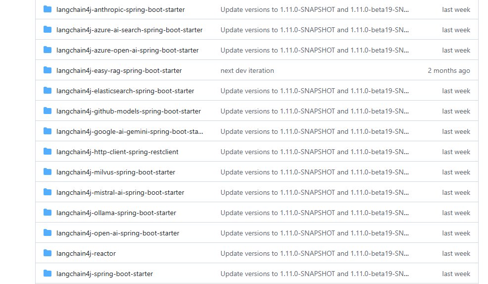

# LangChain4j 🤖

## 一、Spring Boot 集成 🚀

### 1. 支持的版本

- ✅ Spring Boot 3.2
- ✅ JDK 17

### 2. 依赖配置

> Spring Boot Starter 可以帮助你通过配置文件快速创建和配置语言模型、向量模型、向量存储，以及其他 LangChain4j 核心组件。          
> 依赖命名规范为：`langchain4j-{integration-name}-spring-boot-starter`。



```xml
<dependency>
    <groupId>dev.langchain4j</groupId>
    <artifactId>langchain4j-open-ai-spring-boot-starter</artifactId>
    <version>1.3.0-beta9</version>
</dependency>
```


### 3. 配置文件设置

> **提示**：在实际使用时，将 `{api-key}`、`{model-name}` 和 `{base-url}` 替换为实际值

```yml
langchain4j:
  open-ai:
    chat-model:
      api-key: {api-key}  # 你的OpenAI API密钥
      model-name: {model-name}  # 如 gpt-3.5-turbo 或 gpt-4
      base-url: {base-url}  # 可选，自定义API基础URL
      log-requests: true    # 开发阶段建议开启，便于调试
      log-responses: true   # 开发阶段建议开启，便于调试
```


### 4. 简单调用示例

> **初学者提示**：这是最基础的调用方式，直接使用 `OpenAiChatModel` 进行聊天

```java
@RestController
public class ChatController {
    @Autowired
    private OpenAiChatModel chatModel;

    @GetMapping("/chat")
    public String chat(@RequestParam(value = "message", defaultValue = "Hello") String message) {
        return chatModel.chat(message);
    }
}
```


## 二、AI Service 模式 🧠

- LangChain4j 提供了一个 Spring Boot Starter，用于自动配置 AI Services、RAG、Tools 等。
- **优势**：更简洁的开发方式，使用注解驱动的AI服务接口

### 1. 依赖配置

```xml
<dependency>
    <groupId>dev.langchain4j</groupId>
    <artifactId>langchain4j-spring-boot-starter</artifactId>
    <version>1.3.0-beta9</version>
</dependency>
```


### 2. 定义AI服务接口

> **注意**：使用 `@AiService` 注解的接口会被自动实现

```java
@AiService
interface Assistant {
    @SystemMessage("你是一名Java后端开发者，请回答用户问题")
    String chat(String userMessage);
}
```


### 3. 调用AI服务接口

```java
@RestController
class AssistantController {
    @Autowired
    Assistant assistant;

    @GetMapping("/chat")
    public String chat(String message) {
        return assistant.chat(message);
    }
}
```


## 三、自动组件注入 ⚙️

如果上下文中存在以下组件，它们会被自动注入到 AI Service：

- `ChatModel` - 聊天模型
- `StreamingChatModel` - 流式聊天模型
- `ChatMemory` - 聊天记忆
- `ChatMemoryProvider` - 聊天记忆提供者
- `ContentRetriever` - 内容检索器
- `RetrievalAugmentor` - 检索增强器
- 所有 `@Component` 或 `@Service` 类中带 `@Tool` 注解的方法

> **提示**：自动注入简化了配置，适合单个AI服务的场景

## 四、显式组件注入 🔧

- 如果你有多个 AI Service，且需要为它们分别指定不同的组件，可以通过 `@AiService(wiringMode = EXPLICIT)` 来启用显式注入。

> **使用场景**：当项目中需要多个不同配置的AI服务时

```java
@AiService(wiringMode = EXPLICIT, chatModel = "openAiChatModel")
interface OpenAiAssistant {
    @SystemMessage("You are a polite assistant")
    String chat(String userMessage);
}

@AiService(wiringMode = EXPLICIT, chatModel = "ollamaChatModel")
interface OllamaAssistant {
    @SystemMessage("You are a polite assistant")
    String chat(String userMessage);
}
```


## 五、监听 AI Service 注册事件 📡

- LangChain4j 提供了一个 `ApplicationListener<AiServiceRegisteredEvent>` 接口，用于监听 AI Service 的注册事件。
- **用途**：可用于调试、日志记录或动态管理AI服务

```java
@Component
class AiServiceRegisteredEventListener implements ApplicationListener<AiServiceRegisteredEvent> {
    @Override
    public void onApplicationEvent(AiServiceRegisteredEvent event) {
        Class<?> aiServiceClass = event.aiServiceClass();
        List<ToolSpecification> toolSpecifications = event.toolSpecifications();
        for (int i = 0; i < toolSpecifications.size(); i++) {
            System.out.printf("[%s]: [Tool-%s]: %s%n", 
                aiServiceClass.getSimpleName(), 
                i + 1, 
                toolSpecifications.get(i));
        }
    }
}
```


## 六、Flux 流式响应 🌊

- LangChain4j 提供了 `Flux` 封装，用于流式输出。
- **优势**：提供更好的用户体验，可以看到AI逐步生成回复的过程

### 1. 添加依赖

```xml
<dependency>
    <groupId>dev.langchain4j</groupId>
    <artifactId>langchain4j-reactor</artifactId>
    <version>1.3.0-beta9</version>
</dependency>
```


### 2. 使用Flux实现流式响应

```java
@AiService
interface Assistant {
    @SystemMessage("你是一个助手")
    Flux<String> chat(String userMessage);
}
```


> **使用提示**：Flux模式适合需要实时流式输出的场景，如实时对话或逐步思考过程展示

### 3. 前端处理流式响应示例

```javascript
// JavaScript示例：处理Flux流式响应
fetch('/chat?message=你好')
  .then(response => {
    const reader = response.body.getReader();
    const decoder = new TextDecoder();
    
    function readStream() {
      reader.read().then(({done, value}) => {
        if (done) {
          console.log('流结束');
          return;
        }
        const chunk = decoder.decode(value);
        console.log(chunk); // 显示AI的逐步回复
        readStream();
      });
    }
    readStream();
  });
```