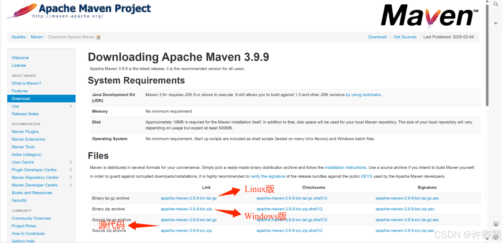
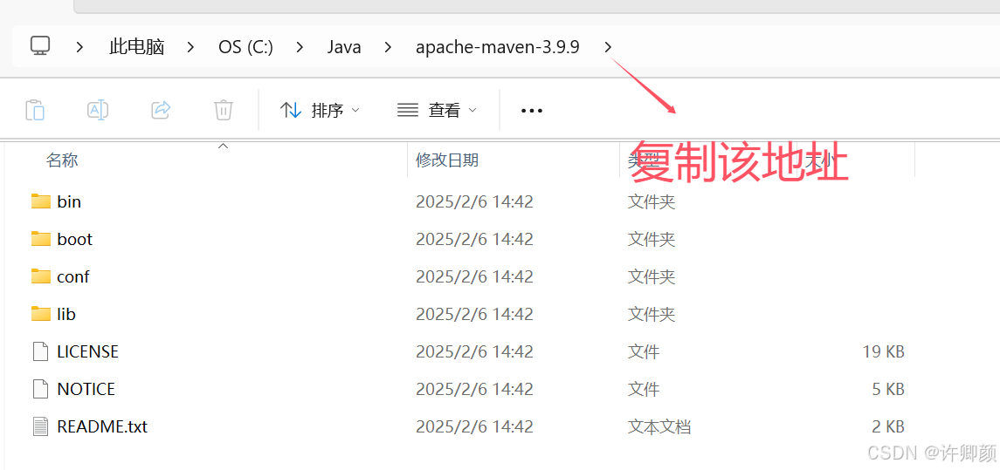
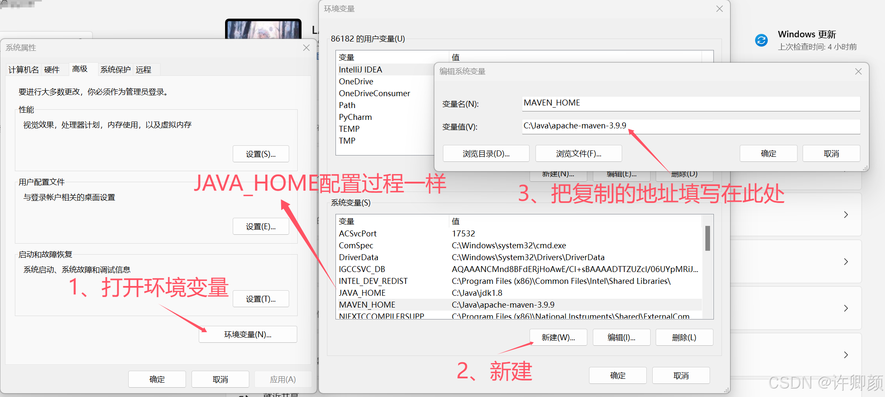
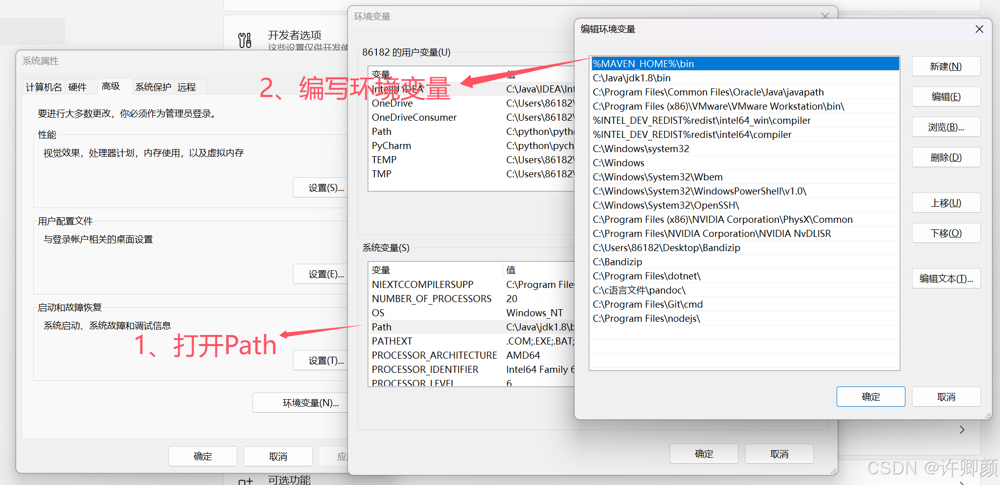
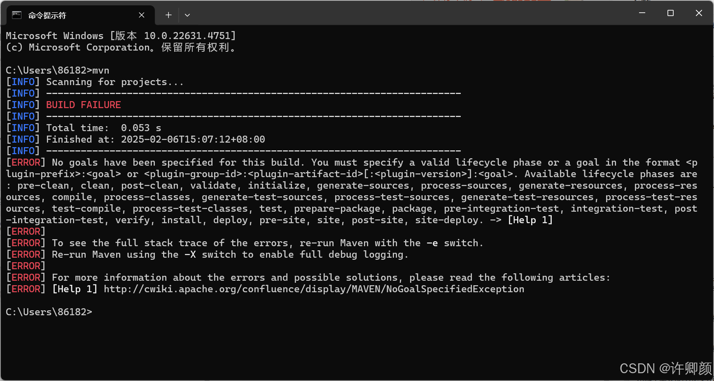
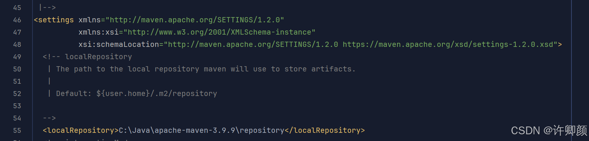
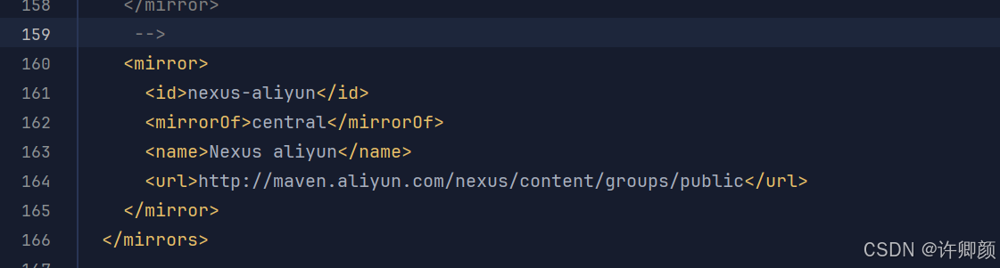
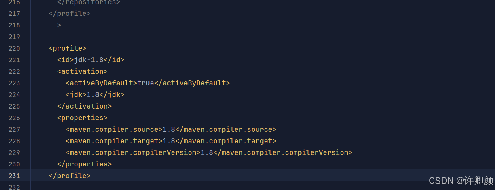

# 📦 Maven 安装与配置指南

## 🌟 一、Maven 简介

### 🎯 Maven 的本质
新一代项目管理工具，将项目开发和管理过程抽象成项目对象模型（POM）

### 📐 POM（Project Object Model）
项目对象模型，是 Maven 的核心概念

### ⭐ Maven 的核心作用

#### 1. 标准化项目构建
- 提供跨平台的自动化构建方式
- 支持统一的构建生命周期（clean/compile/test/package...）

#### 2. 智能化依赖管理
- 自动管理项目依赖（JAR 包）
- 解决依赖传递和版本冲突问题
- 支持从中央仓库自动下载资源

#### 3. 统一开发规范
- 提供标准化的项目目录结构
- 统一团队开发环境和构建流程

---

## 🔧 二、Maven 的安装与配置

### 🌐 官网下载地址
[http://maven.apache.org/download.cgi](http://maven.apache.org/download.cgi)


### 📦 Maven 的安装
Maven 属于绿色版软件，解压即可完成安装。


### ⚙️ Maven 的配置
- Maven 是一个用 Java 语言开发的程序，它必须基于 JDK 来运行，需要通过 `JAVA_HOME` 来找到 JDK 的安装位置
- 由于依赖 Java，所以需要配置 `JAVA_HOME`
- 要设置 Maven 自身的运行环境，需要配置 `MAVEN_HOME`

### 👣 安装步骤

#### 1. 复制 maven 的地址


#### 2. 配置 Maven



#### 3. 验证环境配置是否成功
打开 cmd 输入 `mvn` 命令出现以下情况则环境配置成功


#### 4. 本地仓库配置
Maven 启动后，会自动保存下载的资源到本地仓库（在 `conf/settings.xml` 中配置）


#### 5. 配置阿里提供的镜像仓库
Maven 下载 jar 包默认访问境外的中央仓库，速度很慢。改成阿里云提供的镜像仓库，访问国内网站，可以让 Maven 下载 jar 包的时候速度更快。配置的方式是：将下面 `mirror` 标签整体复制到 `mirrors` 标签的内部。


```xml
<mirrors>
    <mirror>
        <id>nexus-aliyun</id>
        <mirrorOf>central</mirrorOf>
        <name>Nexus aliyun</name>
        <url>http://maven.aliyun.com/nexus/content/groups/public</url>
    </mirror>
</mirrors>
```


#### 6. 配置 Maven 工程的基础 JDK 版本
如果按照默认配置运行，Java 工程使用的 JDK 版本是 1.5。配置的方式是：将 `profile` 标签整个复制到 `profiles` 标签内。


```xml
<profiles>
    <profile>
      <id>jdk-1.8</id>
      <activation>
        <activeByDefault>true</activeByDefault>
        <jdk>1.8</jdk>
      </activation>
      <properties>
        <maven.compiler.source>1.8</maven.compiler.source>
        <maven.compiler.target>1.8</maven.compiler.target>
        <maven.compiler.compilerVersion>1.8</maven.compiler.compilerVersion>
      </properties>
    </profile>
</profiles>
```


---

## 📚 三、Maven 的基础概念

###  warehouse 仓库

#### 仓库定义
用于存储资源，包含各种 jar 包。

#### 仓库分类
- **本地仓库**：存储在自己电脑上的资源仓库，通过连接远程仓库获取资源
- **远程仓库**：非本机电脑上的仓库，为本地仓库提供资源
    - **中央仓库**：由 Maven 团队维护，存储所有资源的仓库
    - **私服**：部门或公司范围内存储资源的仓库，从中央仓库获取资源

#### 私服的作用
- 保存具有版权的资源，包含购买或自主研发的 jar 包
    - 中央仓库中的 jar 包都是开源的，不能存储具有版权的资源
- 在一定范围内共享资源，仅对内部开放，不对外共享

### 🎯 坐标

#### 坐标定义
通过三个向量在 Maven 仓库中唯一定位一个 jar 包。

- `groupId`：公司或组织的 id
- `artifactId`：项目或项目中某个模块的 id
- `version`：版本号

#### 三个向量的取值方式
- `groupId`：公司或组织域名的倒序，通常也会加上项目名称
- `artifactId`：模块的名称，将来作为 Maven 工程的工程名
- `version`：模块的版本号，根据需要设定
    - 例如：`SNAPSHOT` 表示快照版本，正在迭代过程中，属于不稳定的版本
    - 例如：`RELEASE` 表示正式版本