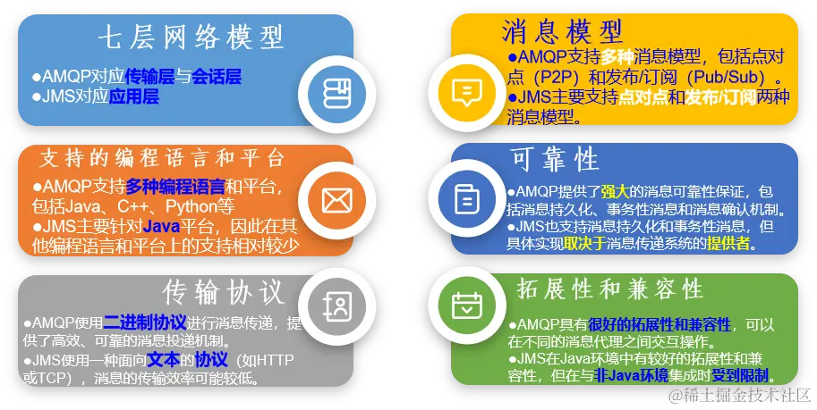
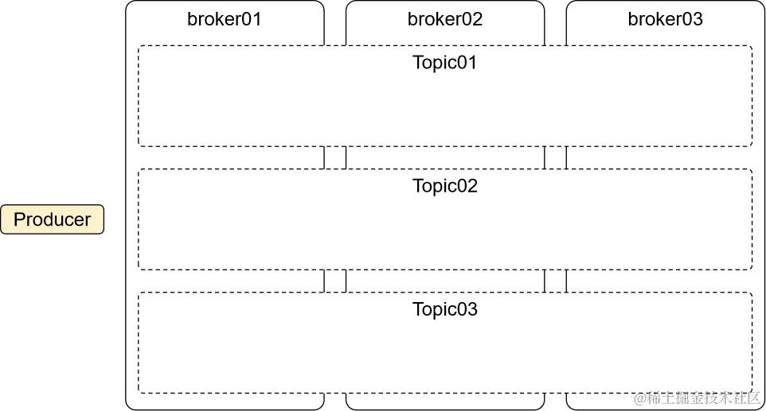
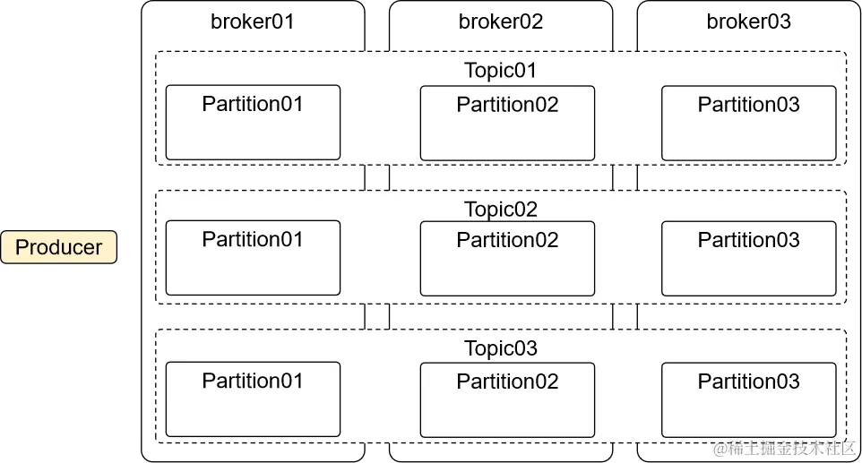
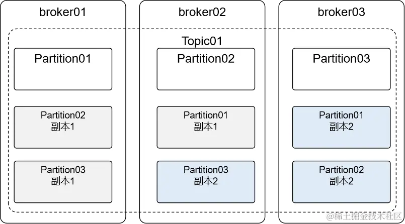
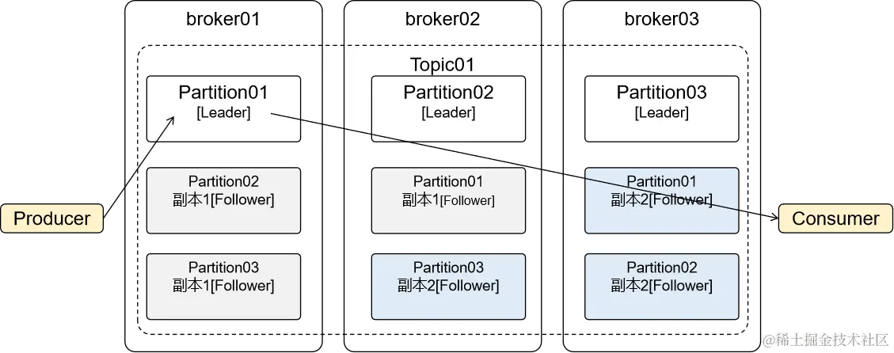
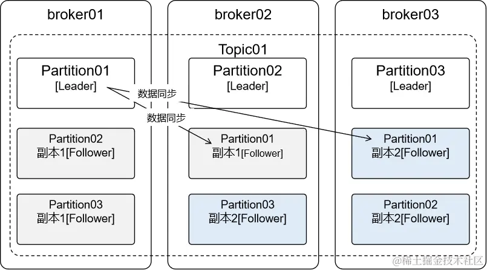
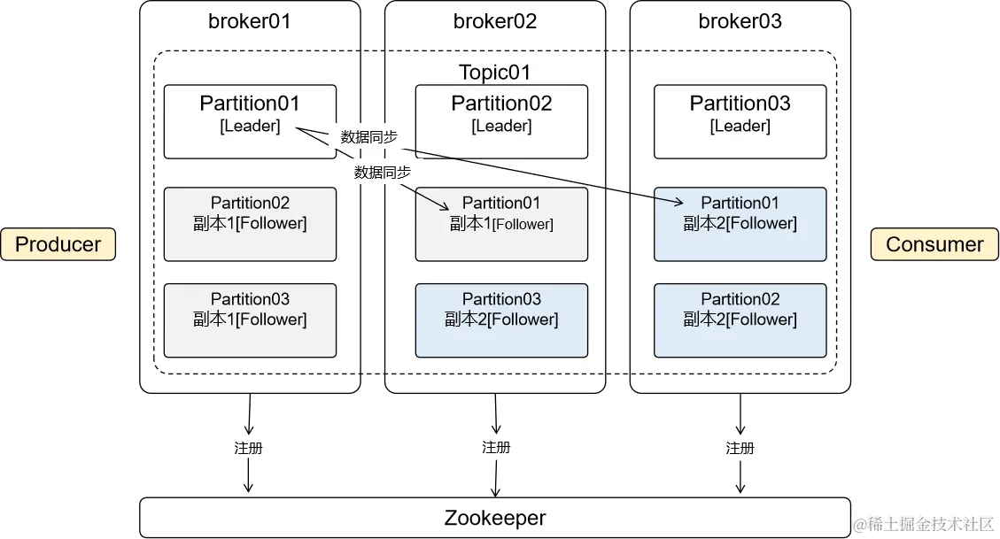

# Kafka 

## 消息队列

### 概念

- 消息队列是实现应用程序和应用程序之间通信的中间件产品

### 消息队列底层实现的两大主流方式

- 由于消息队列执行的是跨应用的信息传递，所以制定底层通信标准非常必要目前主流的消息队列通信协议标准包括：

  - AMQP (Advanced Message Queuing Protocol)：通用协议，IBM公司研发
  - JMS (Java Message Service)：专门为Java语言服务，SUN公司研发，一组由Java接口组成的Java标准

### 主流消息队列产品

这是一个基于图片内容的Markdown笔记格式表格，对比了RabbitMQ、ActiveMQ、RocketMQ和Kafka的主要特性：

| 对比维度 | RabbitMQ | ActiveMQ | RocketMQ | Kafka |
| :--- | :--- | :--- | :--- | :--- |
| **研发团队** | Rabbit(公司) | Apache(社区) | 阿里(公司) | Apache(社区) |
| **开发语言** | Erlang | Java | Java | Scala&Java |
| **核心机制** | 基于AMQP的消息队列模型使用生产者-消费者模式，将消息发布到队列中，然后被消费者订阅和处理 | 基于JMS的消息传递模型支持点对点模型和发布-订阅模型 | 分布式的消息队列模型采用主题(Topic)和标签(Tag)的方式进行消息的分类和过滤 | 分布式流平台，通过发布-订阅模型进行高吞吐量的消息处理 |
| **协议支持** | XMPP STOMP SMTP | XMPP STOMP OpenWire REST | 自定义协议 | 自定义协议社区封装了HTTP协议支持 |
| **客户端支持语言** | 官方支持Erlang、Java、Ruby等社区产出多种API，几乎支持所有语言 | Java C/C++ Python PHP Perl .NET等 | Java C++不成熟 | 官方支持Java社区产出多种API，如PHP、Python等 |
| **可用性** | 镜像队列 | 主从复制 | 主从复制 | 分区和副本 |
| **单机吞吐量** | 每秒十万左右级别 | 每秒数万级 | 每秒十万+级(双十一) | 每秒百万级 |
| **消息延迟** | 微秒级 | 毫秒级 | 毫秒级 | 毫秒以内 |
| **消息确认** | 完整的消息确认机制 | *(表格留白)* | 内置消息表，消息保存到数据库实现持久化 | *(表格留白)* |
| **功能特性** | 并发能力强，性能极好，延时低，社区活跃，管理界面丰富 | 老牌产品成熟度高文档丰富 | MQ功能比较完备扩展性佳 | 只支持主要的MQ功能毕竟是专门为大数据领域服务的 |

## Kafka介绍

### Kafka是什么

- Kafka是Apache开源的一款基于zookeeper协调的分布式消息系统，具有高吞吐率、高性能、实时、高可靠等特点，可实时处理流式数据。它最初由LinkedIn公司开发，使用Scala语言编写。
- Kafka历经数年的发展，从最初纯粹的消息引擎，到近几年开始在流处理平台生态圈发力，多个组织或公司发布了各种不同特性的产品。常见产品如下：

  - Apache Kafka ：最“正统”的Kafka也是开源版，它是后面其他所有发行版的基础。
  - Cloudera/Hortonworks Kafka ：集成了目前主流的大数据框架，能够帮助用户实现从分布式存储、集群调度、流处理到机器学习、实时数据库等全方位的数据处理。
  - Confluent Kafka ：主要提供基于Kafka的企业级流处理解决方案。

> Apache Kafka，它现在依然是开发人数最多、版本迭代速度最快的Kafka。

### Kafka的特点

- 高吞吐量、低延迟：即使是非常普通的硬件Kafka也可以支持每秒数百万的消息，它的延迟最低只有几毫秒
- 持久性：支持消息持久化，即使数TB级别的消息也能够保持长时间的稳定性能
- 可靠性：支持数据备份防止丢失
- 容错性：支持通过Kafka服务器和消费机集群来分区消息，允许集群中的节点失败（若分区副本数量为n，则允许n-1个节点失败）
- 高并发：单机可支持数千个客户端同时读写，支持在线水平扩展。可无缝对接hadoop、strom、spark等，支持Hadoop并行数据加载

### Kafka应用场景

1. 日志收集: 一个公司用Kafka可以收集各种服务的Log，通过Kafka以统一接口服务的方式开放给各种Consumer
2. 消息系统: 解耦生产者和消费者、缓存消息等
3. 用户活动跟踪: 用来记录Web用户或者APP用户的各种活动，如网页搜索、搜索、点击，用户数据收集然后进行用户行为分析。
4. 运营指标: Kafka也经常用来记录运营监控数据。包括收集各种分布式应用的数据，生产各种操作的集中反馈，比如报警和报告
5. 流式处理: 比如 Spark Streaming 和 Storm

### Kafka内部结构

#### 一、Producer

- 生产者：消息发送端

#### 二、Consumer

- 消费者：消息接收端

#### 三、Broker

- 一个Kafka服务器实例，在Kafka集群中会有多个broker实例

#### 四、Topic

- Topic中文意思是主题，在Kafka中只是一个逻辑概念，代表某一类消息。
- 结合具体项目中的业务功能，我们可以为每一个具体功能创建一个Topic。

#### 五、Partition

- Partition中文意思是分区，在Kafka中，有了分区就可以把消息数据分散到不同broker上保存。

#### 六、Replication

- 数据分区之后有一个问题：每个broker上保存一部分数据，如果某个broker宕机，那么数据就会不完整。
- 为了解决这个问题，Kafka引入了Replication机制，将数据进行复制，保证数据不丢失。

#### 七、主从

- 当分区存在副本时，就会区分Leader、Follower：
  - Leader：主分片，负责接收生产者端发送过来的消息，对接消费者端消费消息
  - Follower：不和生产者、消费者交互，仅负责和Leader同步数据

#### 八、注册

- Kafka工作过程中，broker、Partition……信息都需要在Zookeeper中注册

