# Kafka 🚀

## 消息队列 📨

### 概念

- 消息队列是实现应用程序和应用程序之间通信的中间件产品


### 消息队列底层实现的两大主流方式

- 由于消息队列执行的是跨应用的信息传递，所以制定底层通信标准非常必要目前主流的消息队列通信协议标准包括：

  - AMQP (Advanced Message Queuing Protocol)：通用协议，IBM公司研发
  - JMS (Java Message Service)：专门为Java语言服务，SUN公司研发，一组由Java接口组成的Java标准


### 主流消息队列产品

这是一个基于图片内容的Markdown笔记格式表格，对比了RabbitMQ、ActiveMQ、RocketMQ和Kafka的主要特性：

| 对比维度 | RabbitMQ | ActiveMQ | RocketMQ | Kafka |
| :--- | :--- | :--- | :--- | :--- |
| **研发团队** | Rabbit(公司) | Apache(社区) | 阿里(公司) | Apache(社区) |
| **开发语言** | Erlang | Java | Java | Scala&Java |
| **核心机制** | 基于AMQP的消息队列模型使用生产者-消费者模式，将消息发布到队列中，然后被消费者订阅和处理 | 基于JMS的消息传递模型支持点对点模型和发布-订阅模型 | 分布式的消息队列模型采用主题(Topic)和标签(Tag)的方式进行消息的分类和过滤 | 分布式流平台，通过发布-订阅模型进行高吞吐量的消息处理 |
| **协议支持** | XMPP<br>STOMP<br>SMTP | XMPP<br>STOMP<br>OpenWire<br>REST | 自定义协议 | 自定义协议社区封装了HTTP协议支持 |
| **客户端支持语言** | 官方支持Erlang、Java、Ruby等社区产出多种API，几乎支持所有语言 | Java<br>C/C++<br>Python<br>PHP<br>Perl<br>.NET等 | Java<br>C++不成熟 | 官方支持Java社区产出多种API，如PHP、Python等 |
| **可用性** | 镜像队列 | 主从复制 | 主从复制 | 分区和副本 |
| **单机吞吐量** | 每秒十万左右级别 | 每秒数万级 | 每秒十万+级(双十一) | 每秒百万级 |
| **消息延迟** | 微秒级 | 毫秒级 | 毫秒级 | 毫秒以内 |
| **消息确认** | 完整的消息确认机制 | *(表格留白)* | 内置消息表，消息保存到数据库实现持久化 | *(表格留白)* |
| **功能特性** | 并发能力强，性能极好，延时低，社区活跃，管理界面丰富 | 老牌产品成熟度高文档丰富 | MQ功能比较完备扩展性佳 | 只支持主要的MQ功能毕竟是专门为大数据领域服务的 |

## Kafka介绍 📚

### Kafka是什么

- Kafka是Apache开源的一款基于zookeeper协调的分布式消息系统，具有高吞吐率、高性能、实时、高可靠等特点，可实时处理流式数据。它最初由LinkedIn公司开发，使用Scala语言编写。
- Kafka历经数年的发展，从最初纯粹的消息引擎，到近几年开始在流处理平台生态圈发力，多个组织或公司发布了各种不同特性的产品。常见产品如下：

  - **Apache Kafka**：最"正统"的Kafka也是开源版，它是后面其他所有发行版的基础。
  - **Cloudera/Hortonworks Kafka**：集成了目前主流的大数据框架，能够帮助用户实现从分布式存储、集群调度、流处理到机器学习、实时数据库等全方位的数据处理。
  - **Confluent Kafka**：主要提供基于Kafka的企业级流处理解决方案。

> Apache Kafka，它现在依然是开发人数最多、版本迭代速度最快的Kafka。

### Kafka的特点 🌟

- **高吞吐量、低延迟**：即使是非常普通的硬件Kafka也可以支持每秒数百万的消息，它的延迟最低只有几毫秒
- **持久性**：支持消息持久化，即使数TB级别的消息也能够保持长时间的稳定性能
- **可靠性**：支持数据备份防止丢失
- **容错性**：支持通过Kafka服务器和消费机集群来分区消息，允许集群中的节点失败（若分区副本数量为n，则允许n-1个节点失败）
- **高并发**：单机可支持数千个客户端同时读写，支持在线水平扩展。可无缝对接hadoop、strom、spark等，支持Hadoop并行数据加载

### Kafka应用场景 💼

1. **日志收集**: 一个公司用Kafka可以收集各种服务的Log，通过Kafka以统一接口服务的方式开放给各种Consumer
2. **消息系统**: 解耦生产者和消费者、缓存消息等
3. **用户活动跟踪**: 用来记录Web用户或者APP用户的各种活动，如网页搜索、搜索、点击，用户数据收集然后进行用户行为分析。
4. **运营指标**: Kafka也经常用来记录运营监控数据。包括收集各种分布式应用的数据，生产各种操作的集中反馈，比如报警和报告
5. **流式处理**: 比如 Spark Streaming 和 Storm

### Kafka内部结构 🏗️

#### 一、Producer

- 生产者：消息发送端


#### 二、Consumer

- 消费者：消息接收端


#### 三、Broker

- 一个Kafka服务器实例，在Kafka集群中会有多个broker实例


#### 四、Topic

- 主题是一个逻辑概念，用于生产者发布数据，消费者拉取数据
- Kafka中的主题必须要有标识符，而且是唯一的，Kafka中可以有任意数量的主题，没有数量上的限制
- 在主题中的消息是有结构的，一般一个主题包含某一类消息
- 一旦生产者发送消息到主题中，这些消息就不能被更新（更改）


#### 五、Partition

- Partition中文意思是分区，在Kafka中，有了分区就可以把消息数据分散到不同broker上保存。


#### 六、Replication

- 数据分区之后有一个问题：每个broker上保存一部分数据，如果某个broker宕机，那么数据就会不完整。
- 为了解决这个问题，Kafka引入了Replication机制，将数据进行复制，保证数据不丢失。


#### 七、主从

- 当分区存在副本时，就会区分Leader、Follower：
  - **Leader**：主分片，负责接收生产者端发送过来的消息，对接消费者端消费消息
  - **Follower**：不和生产者、消费者交互，仅负责和Leader同步数据


#### 八、注册

- Kafka工作过程中，broker、Partition……信息都需要在Zookeeper中注册


#### 九、consumer group（消费者组）

- consumer group 是 kafka 提供的可扩展且具有容错性的消费者机制
- 一个消费者组可以包含多个消费者
- 一个消费者组有一个唯一的ID（group Id）
- 组内的消费者一起消费主题的所有分区数据

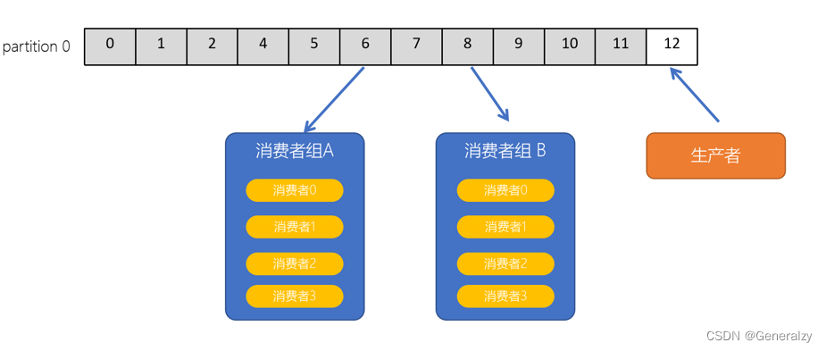

#### 十、偏移量（offset）

- offset 记录着下一条将要发送给 Consumer 的消息的序号
- 默认 Kafka 将 offset 存储在 ZooKeeper 中
- 在一个分区中，消息是有顺序的方式存储着，每个在分区的消费都是有一个递增的id。这个就是偏移量offset
- 偏移量在分区中才是有意义的。在分区之间，offset是没有任何意义的

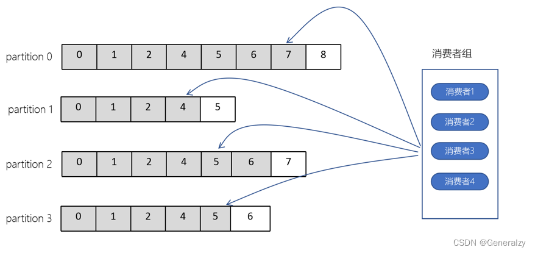

## Kafka生产者 📤

### 生产者消息发送流程

#### 发送原理

- 在消息发送的过程中，涉及到了两个线程 main 线程和 Sender 线程。在 main 线程中创建了一个双端队列 [RecordAccumulator](RecordAccumulator)。main 线程将消息发送给 [ResordAccumlator](ResordAccumlator)，Sender 线程不断从 [RecordAccumulator](RecordAccumulator) 中拉去消息发送到 Kafka Broker。

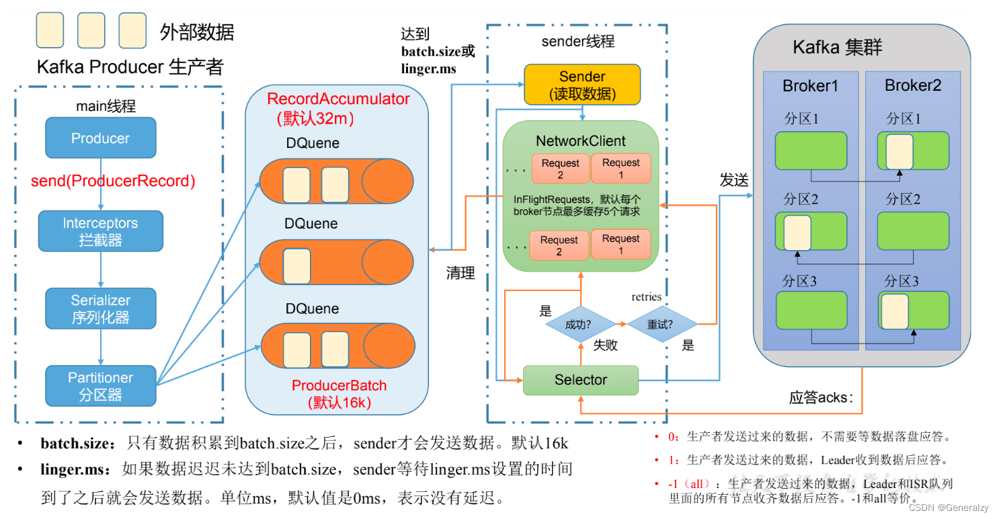

#### 生产者重要参数列表

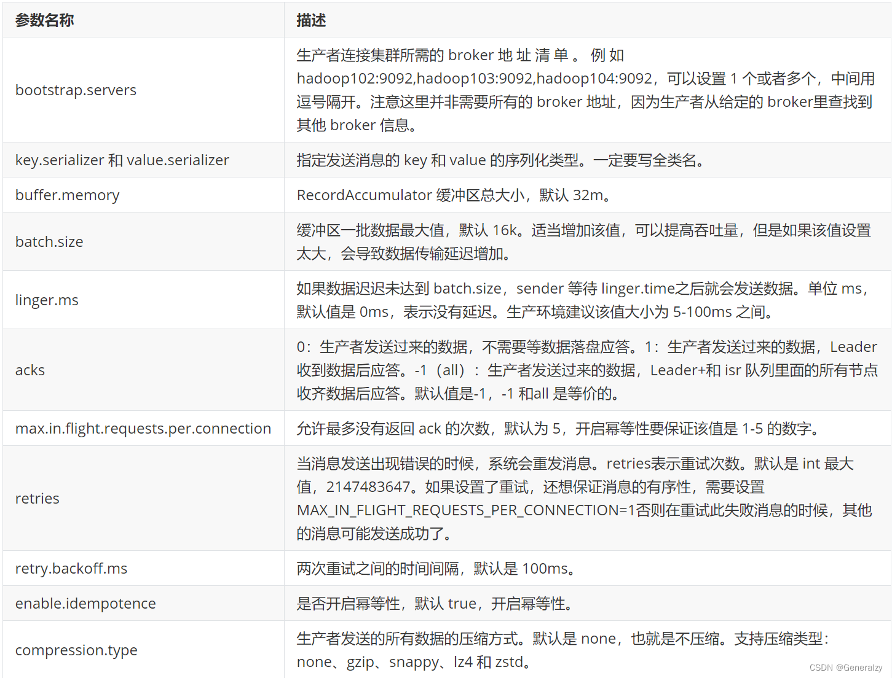

### 生产者分区

#### 分区和副本机制

生产者写入消息到topic，Kafka将依据不同的策略将数据分配到不同的分区中

1. 轮询分区策略
2. 随机分区策略
3. 按key分区分配策略
4. 自定义分区策略

#### 分区好处

- 便于合理使用存储资源，每个Partition在一个Broker上存储，可以把海量的数据按照分区切割成一块一块数据存储在多台Broker上。合理控制分区的任务，可以实现负载均衡的效果
- 提高并行度，生产者可以以分区为单位发送数据；消费者可以以分区为单位进行消费数据

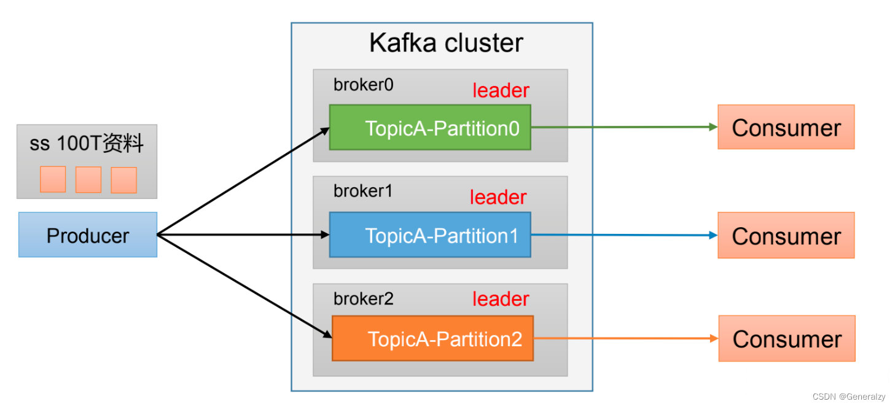

##### 轮询分区策略

- 默认的策略，也是使用最多的策略，可以最大限度保证所有消息平均分配到一个分区
- 如果在生产消息时，key为null，则使用轮询算法均衡地分配分区

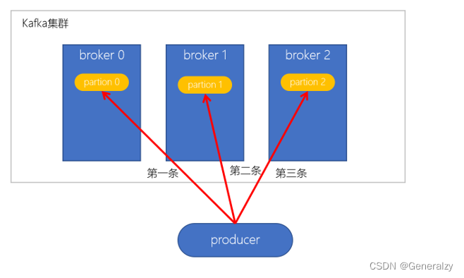

##### 随机分区策略(不建议采用)

- 随机策略，每次都随机地将消息分配到每个分区。在较早的版本，默认的分区策略就是随机策略，也是为了将消息均衡地写入到每个分区。但后续轮询策略表现更佳，所以基本上很少会使用随机策略。

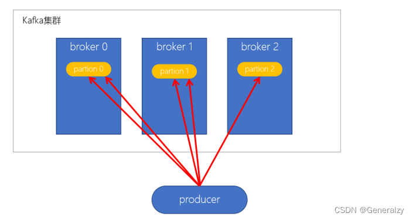

##### 按 key 分区分配策略

- 按key分配策略，有可能会出现「数据倾斜」，例如：某个key包含了大量的数据，因为key值一样，所有所有的数据将都分配到一个分区中，造成该分区的消息数量远大于其他的分区

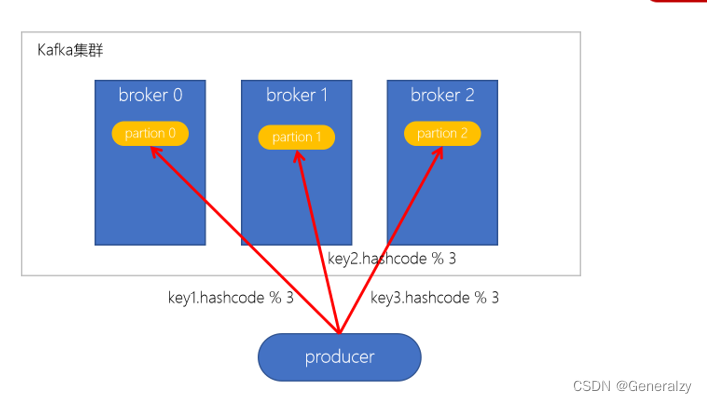

> 📌 **乱序问题** <br>
> 轮询策略、随机策略都会导致一个问题，生产到Kafka中的数据是乱序存储的。而按key分区可以一定程度上实现数据有序存储——也就是局部有序，但这又可能会导致数据倾斜，所以在实际生产环境中要结合实际情况来做取舍。

### 副本机制

> 🛡️ **副本的目的就是冗余备份，当某个 Broker 上的分区数据丢失时，依然可以保障数据可用。因为在其他的 Broker 上的副本是可用的。**

#### producer 的 ACKs 参数

- 对副本关系较大的就是，producer 配置的 [acks](acks) 参数了,[acks](acks) 参数表示当生产者生产消息的时候，写入到副本的要求严格程度。它决定了生产者如何在性能和可靠性之间做取舍。

#### acks 配置为 0

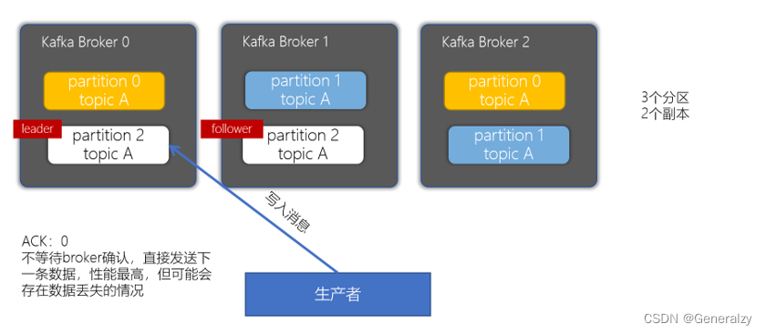

#### acks 配置为 1

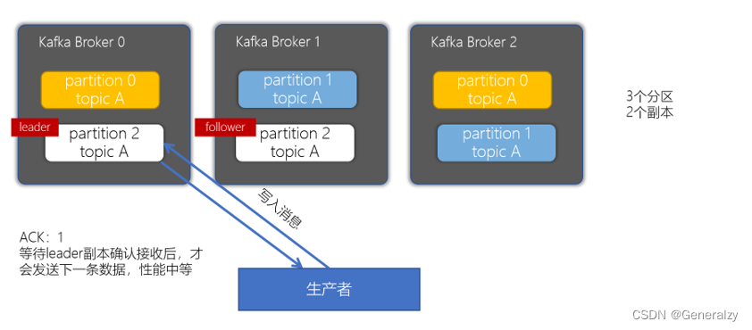

- 当生产者的ACK配置为1时，生产者会等待leader副本确认接收后，才会发送下一条数据，性能中等

#### acks 配置为 -1 或者 all

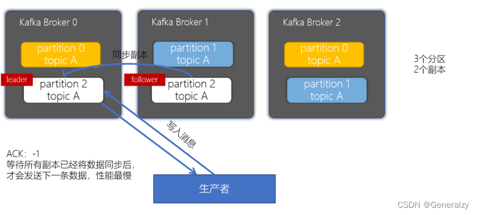

### Kafka 生产者幂等性与事务

#### 幂等性

- 拿http举例来说，一次或多次请求，得到地响应是一致的（网络超时等问题除外），换句话说，就是执行多次操作与执行一次操作的影响是一样的。

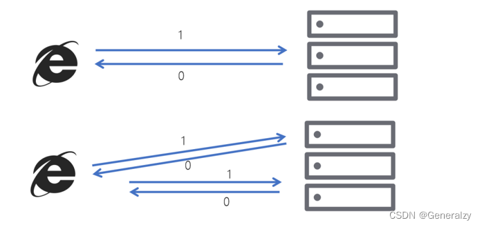

- 如果，某个系统是不具备幂等性的，如果用户重复提交了某个表格，就可能会造成不良影响。例如：用户在浏览器上点击了多次提交订单按钮，会在后台生成多个一模一样的订单。

#### Kafka生产者幂等性

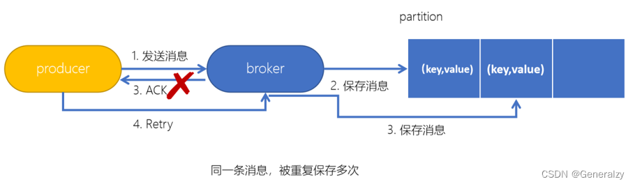

- 在生产者生产消息时，如果出现retry时，有可能会一条消息被发送了多次，如果Kafka不具备幂等性的，就有可能会在partition中保存多条一模一样的消息。

#### Kafka 幂等性原理

为了实现生产者的幂等性，Kafka引入了 Producer ID（PID）和 Sequence Number的概念。

- **PID**：每个Producer在初始化时，都会分配一个唯一的PID，这个PID对用户来说，是透明的。
- **Sequence Number**：针对每个生产者（对应PID）发送到指定主题分区的消息都对应一个从0开始递增的Sequence Number。
- 幂等性只能保证的是在单分区单会话内不重复

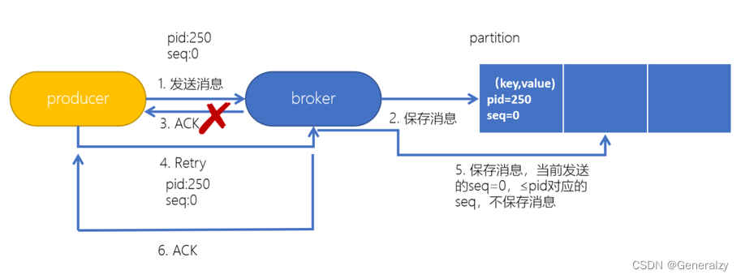

### Kafka 事务

- Kafka事务是2017年 Kafka 0.11.0.0 引入的新特性。类似于数据库的事务。Kafka 事务指的是生产者生产消息以及消费者提交offset的操作可以在一个原子操作中，要么都成功，要么都失败。尤其是在生产者、消费者并存时，事务的保障尤其重要。（consumer-transform-producer模式）
- 开启事务，必须开启幂等性

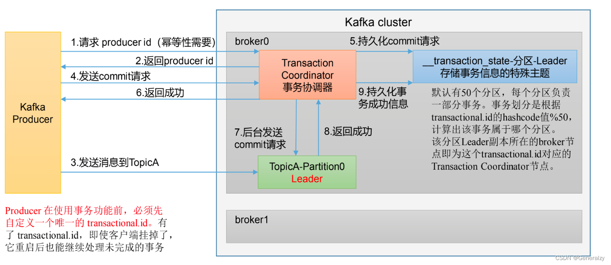

#### 事务操作API

[Producer](Producer)接口中定义了以下5个事务相关方法：

1. **initTransactions**（初始化事务）：要使用Kafka事务，必须先进行初始化操作
2. **beginTransaction**（开始事务）：启动一个Kafka事务
3. **sendOffsetsToTransaction**（提交偏移量）：批量地将分区对应的offset发送到事务中，方便后续一块提交
4. **commitTransaction**（提交事务）：提交事务
5. **abortTransaction**（放弃事务）：取消事务

### 数据有序和数据乱序

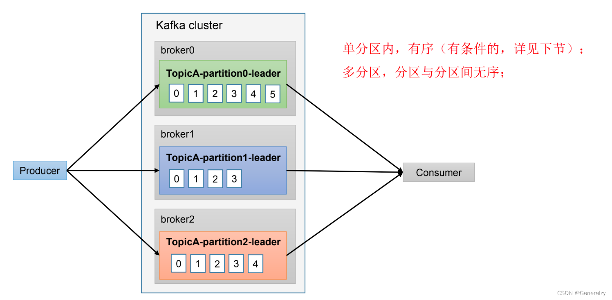

## Kafka Broker 🏢

### Zookeeper 存储的 Kafka 信息

```bash
[zk: localhost:2181(CONNECTING) 0] ls /
[admin, brokers, cluster, config, consumers, controller, controller_epoch, feature, isr_change_notification, latest_producer_id_block, log_dir_event_notification, zookeeper]
```


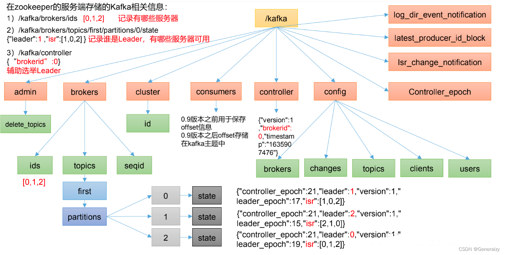

### Kafka Broker 总体工作流程

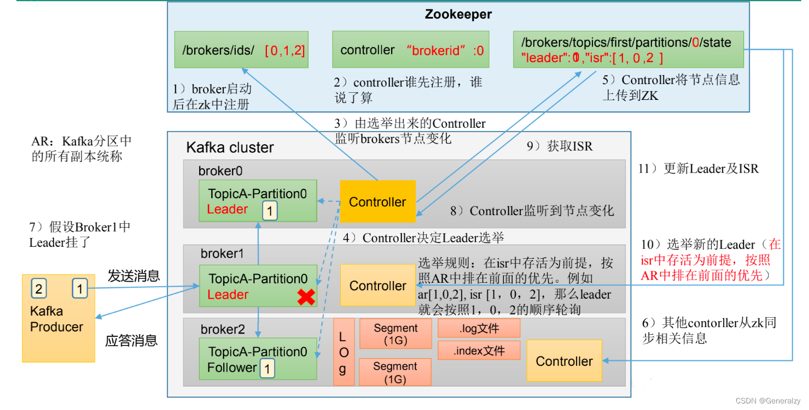

### Broker 重要参数

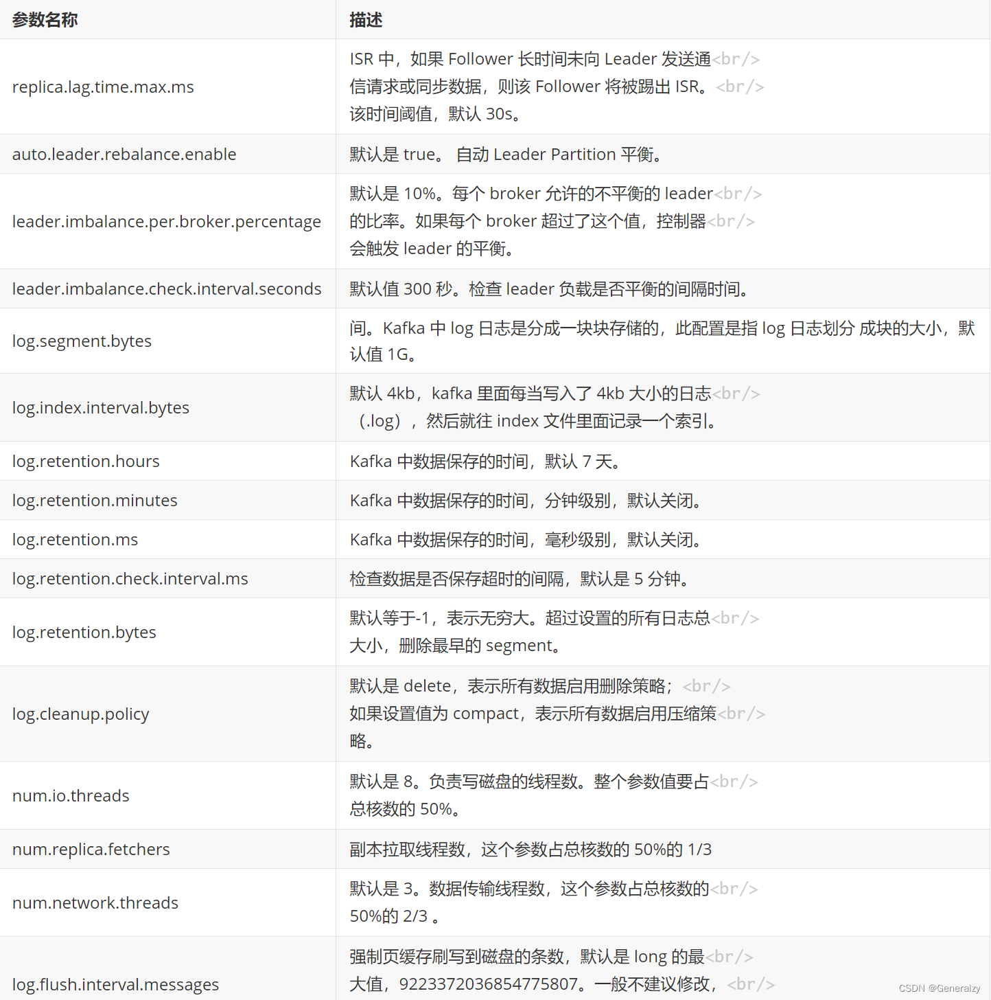

### Kafka 副本

#### 副本基本信息

1. Kafka副本作用：提高数据可靠性。
2. Kafka默认副本1个，生产环境一般配置为2个，保证数据可靠性；太多副本会增加磁盘存储空间，增加网络上数据传输，降低效率。
3. Kafka中副本为：Leader和Follower。Kafka生产者只会把数据发往 Leader，然后Follower 找 Leader 进行同步数据。
4. Kafka 分区中的所有副本统称为 AR（Assigned Repllicas）。

> AR = ISR + OSR

> **ISR**：表示 Leader 保持同步的 Follower 集合。如果 Follower 长时间未 向 Leader 发送通信请求或同步数据，则该 Follower 将被踢出 ISR。该时间阈值由 [replica.lag.time.max.ms](replica.lag.time.max.ms) 参数设定，默认 30s 。Leader 发生故障之后，就会从 ISR 中选举新的 Leader。

> **OSR**：表示 Follower 与 Leader 副本同步时，延迟过多的副本。

#### Leader 选举流程

- Kafka 集群中有一个 broker 的 Controller 会被选举为 Controller Leader ，负责管理集群 broker 的上下线，所有 topic 的分区副本分配 和 Leader 选举等工作。

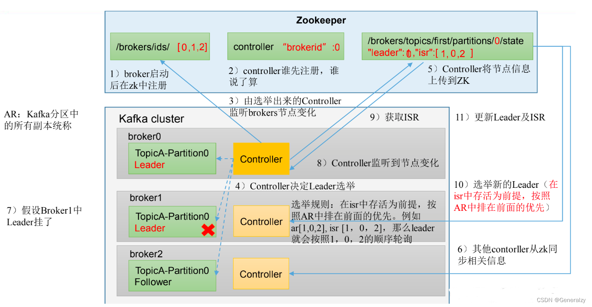

1. 创建一个新的 topic，4 个分区，4 个副本

```shell
[atguigu@hadoop102 kafka]$ bin/kafka-topics.sh --bootstrap-server hadoop102:9092 --create --topic atguigu1 --partitions 4 --replication-factor 4
Created topic atguigu1.
```


2. 查看 Leader 分布情况

```shell
[atguigu@hadoop102 kafka]$ bin/kafka-topics.sh --bootstrap-server hadoop102:9092 --describe 
--topic atguigu1
Topic: atguigu1 TopicId: awpgX_7WR-OX3Vl6HE8sVg PartitionCount: 4 ReplicationFactor: 4
Configs: segment.bytes=1073741824
Topic: atguigu1 Partition: 0 Leader: 3 Replicas: 3,0,2,1 Isr: 3,0,2,1
Topic: atguigu1 Partition: 1 Leader: 1 Replicas: 1,2,3,0 Isr: 1,2,3,0
Topic: atguigu1 Partition: 2 Leader: 0 Replicas: 0,3,1,2 Isr: 0,3,1,2
Topic: atguigu1 Partition: 3 Leader: 2 Replicas: 2,1,0,3 Isr: 2,1,0,3
```


3. 停止掉 hadoop105 的 kafka 进程，并查看 Leader 分区情况

```shell
[atguigu@hadoop105 kafka]$ bin/kafka-server-stop.sh
[atguigu@hadoop102 kafka]$ bin/kafka-topics.sh --bootstrap-server hadoop102:9092 --describe 
--topic atguigu1
Topic: atguigu1 TopicId: awpgX_7WR-OX3Vl6HE8sVg PartitionCount: 4 ReplicationFactor: 4
Configs: segment.bytes=1073741824
Topic: atguigu1 Partition: 0 Leader: 0 Replicas: 3,0,2,1 Isr: 0,2,1
Topic: atguigu1 Partition: 1 Leader: 1 Replicas: 1,2,3,0 Isr: 1,2,0
Topic: atguigu1 Partition: 2 Leader: 0 Replicas: 0,3,1,2 Isr: 0,1,2
Topic: atguigu1 Partition: 3 Leader: 2 Replicas: 2,1,0,3 Isr: 2,1,0
```


4. 停止掉 hadoop104 的 kafka 进程，并查看 Leader 分区情况

```shell
[atguigu@hadoop104 kafka]$ bin/kafka-server-stop.sh
[atguigu@hadoop102 kafka]$ bin/kafka-topics.sh --bootstrap-server hadoop102:9092 --describe 
--topic atguigu1
Topic: atguigu1 TopicId: awpgX_7WR-OX3Vl6HE8sVg PartitionCount: 4 ReplicationFactor: 4
Configs: segment.bytes=1073741824
Topic: atguigu1 Partition: 0 Leader: 0 Replicas: 3,0,2,1 Isr: 0,1
Topic: atguigu1 Partition: 1 Leader: 1 Replicas: 1,2,3,0 Isr: 1,0
Topic: atguigu1 Partition: 2 Leader: 0 Replicas: 0,3,1,2 Isr: 0,1
Topic: atguigu1 Partition: 3 Leader: 1 Replicas: 2,1,0,3 Isr: 1,0
```


5. 启动 hadoop105 的 kafka 进程，并查看 Leader 分区情况

```shell
[atguigu@hadoop105 kafka]$ bin/kafka-server-start.sh -daemon config/server.properties
[atguigu@hadoop102 kafka]$ bin/kafka-topics.sh --bootstrap-server hadoop102:9092 --describe 
--topic atguigu1
Topic: atguigu1 TopicId: awpgX_7WR-OX3Vl6HE8sVg PartitionCount: 4 ReplicationFactor: 4
Configs: segment.bytes=1073741824
Topic: atguigu1 Partition: 0 Leader: 0 Replicas: 3,0,2,1 Isr: 0,1,3
Topic: atguigu1 Partition: 1 Leader: 1 Replicas: 1,2,3,0 Isr: 1,0,3
Topic: atguigu1 Partition: 2 Leader: 0 Replicas: 0,3,1,2 Isr: 0,1,3
Topic: atguigu1 Partition: 3 Leader: 1 Replicas: 2,1,0,3 Isr: 1,0,3
```


6. 启动 hadoop104 的 kafka 进程，并查看 Leader 分区情况

```shell
[atguigu@hadoop104 kafka]$ bin/kafka-server-start.sh -daemon config/server.properties
[atguigu@hadoop102 kafka]$ bin/kafka-topics.sh --bootstrap-server hadoop102:9092 --describe 
--topic atguigu1
Topic: atguigu1 TopicId: awpgX_7WR-OX3Vl6HE8sVg PartitionCount: 4 ReplicationFactor: 4
Configs: segment.bytes=1073741824
Topic: atguigu1 Partition: 0 Leader: 0 Replicas: 3,0,2,1 Isr: 0,1,3,2
Topic: atguigu1 Partition: 1 Leader: 1 Replicas: 1,2,3,0 Isr: 1,0,3,2
Topic: atguigu1 Partition: 2 Leader: 0 Replicas: 0,3,1,2 Isr: 0,1,3,2
Topic: atguigu1 Partition: 3 Leader: 1 Replicas: 2,1,0,3 Isr: 1,0,3,2
```


7. 停止掉 hadoop103 的 kafka 进程，并查看 Leader 分区情况

```shell
[atguigu@hadoop103 kafka]$ bin/kafka-server-stop.sh
[atguigu@hadoop102 kafka]$ bin/kafka-topics.sh --bootstrap-server hadoop102:9092 --describe 
--topic atguigu1
Topic: atguigu1 TopicId: awpgX_7WR-OX3Vl6HE8sVg PartitionCount: 4 ReplicationFactor: 4
Configs: segment.bytes=1073741824
Topic: atguigu1 Partition: 0 Leader: 0 Replicas: 3,0,2,1 Isr: 0,3,2
Topic: atguigu1 Partition: 1 Leader: 2 Replicas: 1,2,3,0 Isr: 0,3,2
Topic: atguigu1 Partition: 2 Leader: 0 Replicas: 0,3,1,2 Isr: 0,3,2
Topic: atguigu1 Partition: 3 Leader: 2 Replicas: 2,1,0,3 Isr: 0,3,2
```


#### Leader 和 Follower 故障处理细节

- **LEO**（Log End Offset）: 每个副本的最后一个offset，LEO其实就是最新的 offset + 1。
- **HW**（High Watermark）：所有副本中最小的LEO。

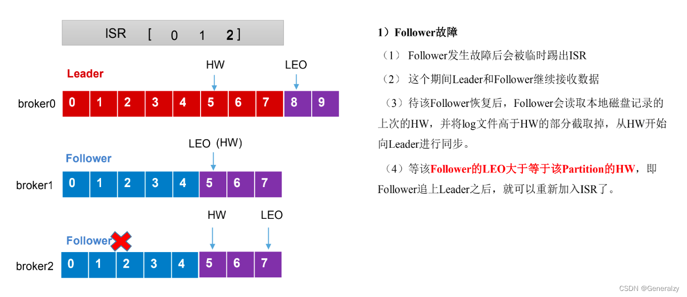

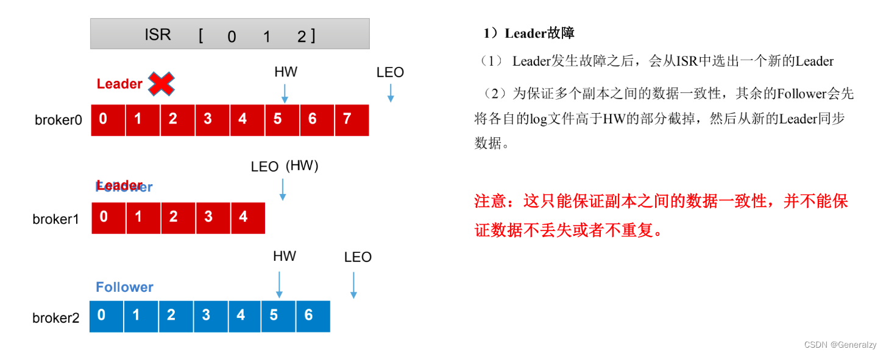

#### 手动调整分区副本存储

- 在生产环境中，每台服务器的配置和性能不一致，但是kafka只会根据自己的代码规则创建对应的分区副本，就会导致个别服务器存储压力较大。所有需要手动调整分区副本的存储。
- 需求：创建一个新的 topic ，4个分区，两个副本，名称为three 。将该 topic 的所有副本都存储到 broker0 和 broker1 两台服务器上。

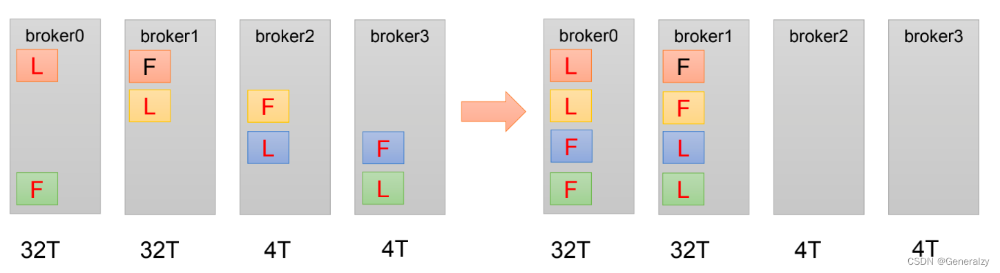

手动调整分区副本存储的步骤如下：

1. 创建一个新的 topic，名称为 three

```shell
[atguigu@hadoop102 kafka]$ bin/kafka-topics.sh --bootstrap-server 
hadoop102:9092 --create --partitions 4 --replication-factor 2 --
topic three
```


2. 查看分区副本存储情况

```shell
[atguigu@hadoop102 kafka]$ bin/kafka-topics.sh --bootstrap-server 
hadoop102:9092 --describe --topic three
```


3. 创建副本存储计划（所有副本都指定存储在 broker0、broker1 中）

```shell
[atguigu@hadoop102 kafka]$ vim increase-replication-factor.json
```

输入如下内容：
```json
{
  "version":1,
  "partitions":[{"topic":"three","partition":0,"replicas":[0,1]},
  {"topic":"three","partition":1,"replicas":[0,1]},
  {"topic":"three","partition":2,"replicas":[1,0]},
  {"topic":"three","partition":3,"replicas":[1,0]}] 
}
```


4. 执行副本存储计划

```shell
[atguigu@hadoop102 kafka]$ bin/kafka-reassign-partitions.sh --
bootstrap-server hadoop102:9092 --reassignment-json-file 
increase-replication-factor.json --execute
```


5. 验证副本存储计划

```shell
[atguigu@hadoop102 kafka]$ bin/kafka-reassign-partitions.sh --
bootstrap-server hadoop102:9092 --reassignment-json-file 
increase-replication-factor.json --verify
```


6. 查看分区副本存储情况

```shell
[atguigu@hadoop102 kafka]$ bin/kafka-topics.sh --bootstrap-server 
hadoop102:9092 --describe --topic three
```


#### Leader Partition 负载平衡

- 正常情况下，Kafka本身会自动把Leader Partition均匀分散在各个机器上，来保证每台机器的读写吞吐量都是均匀的。但是如果某些broker宕机，会导致Leader Partition过于集中在其他少部分几台broker上，这会导致少数几台broker的读写请求压力过高，其他宕机的broker重启之后都是follower partition，读写请求很低，造成集群负载不均衡。

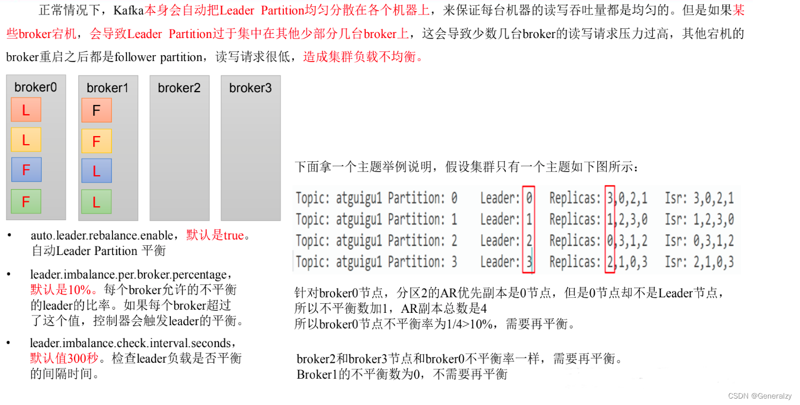

| 参数名称 | 描述 |
| :--- | :--- |
| [auto.leader.rebalance.enable](auto.leader.rebalance.enable) | 默认是 true。自动 Leader Partition 平衡。生产环境中，leader 重选举的代价比较大，可能会带来性能影响，建议设置为 false 关闭。 |
| [leader.imbalance.per.broker.percentage](leader.imbalance.per.broker.percentage) | 默认是 10%。每个 broker 允许的不平衡的 leader 的比率。如果每个 broker 超过了这个值，控制器会触发 leader 的平衡。 |
| [leader.imbalance.check.interval.seconds](leader.imbalance.check.interval.seconds) | 默认值 300 秒。检查 leader 负载是否平衡的间隔时间。 |

### 文件存储

#### Topic 数据的存储机制

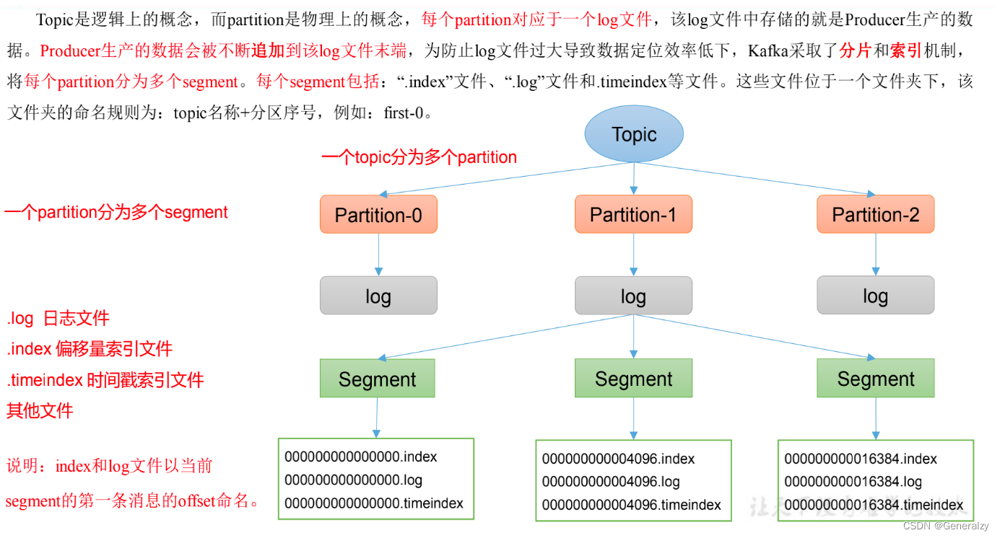

#### 文件清理策略

Kafka 中默认的日志保存时间为 7 天，可以通过调整如下参数修改保存时间。

- [Log.retention.hours](Log.retention.hours)，最低优先级小时，默认7天。
- [log.retention.minutes](log.retention.minutes)，分钟。
- [log.retention.ms](log.retention.ms)，最高优先级毫秒。
- [log.retention.check.interval.ms](log.retention.check.interval.ms)，负责设置检查周期，默认 5 分钟。

那么日志一旦超过了设置的时间，怎么处理呢？

##### Kafka 中提供的日志清理策略有 delete 和 compact 两种。

1. **delete 日志阐述**：将过期数据删除
- [log.cleanup.policy](log.cleanup.policy) = delete 所有数据启用阐述策略

(1) 基于时间：默认打开。以 segment 中所有记录中的最大时间戳作为该文件时间戳。

(2) 基于大小：默认关闭。超过设置的所有日志总大小，阐述最早的 segment 。

> [log.retention.bytes](log.retention.bytes)，默认等于-1，表示无穷大。

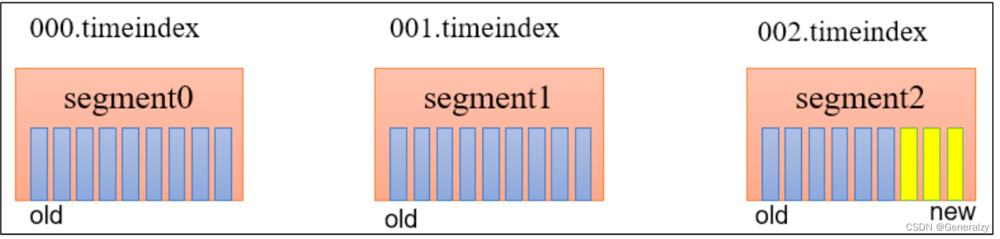

2. **compact 日志压缩**

- compact日志压缩：对于相同 key 的不同 value 值，值保留最后一个版本。
- [log.cleanup.policy](log.cleanup.policy) = compact所有数据启动压缩策略


- 压缩后的offset可能是不连续的，比如上图中没有6，当从这些offset消费消息时，将会拿到比这个 offset 大的 offset 对应的消息，实际上会拿到 offset 为 7 的消息，并从这个位置开始消费。
- 这种策略只适合特殊场景，比如消息的 key 是用户 ID，value 是用户的资料，通过这种压缩策略，整个消息集里就保存了所有用户最新的资料。

## Kafka 消费者 📥

### Kafka 消费方式

- **pull**（拉）模式：consumer 采用从 broker 中主动拉去数据。Kafka 采用这种方式。
- **push**（推）模式：Kafka没有采用这种方式，因为由 broker 决定消息发送速率，很难适应所有消费者的消费速率。例如推送的速度是 50m/s，Consumer1，Consumer2就来不及处理消息。
> pull 模式不足之处是，如果Kafka 没有数据，消费者可能会陷入循环中，一直返回空数据。

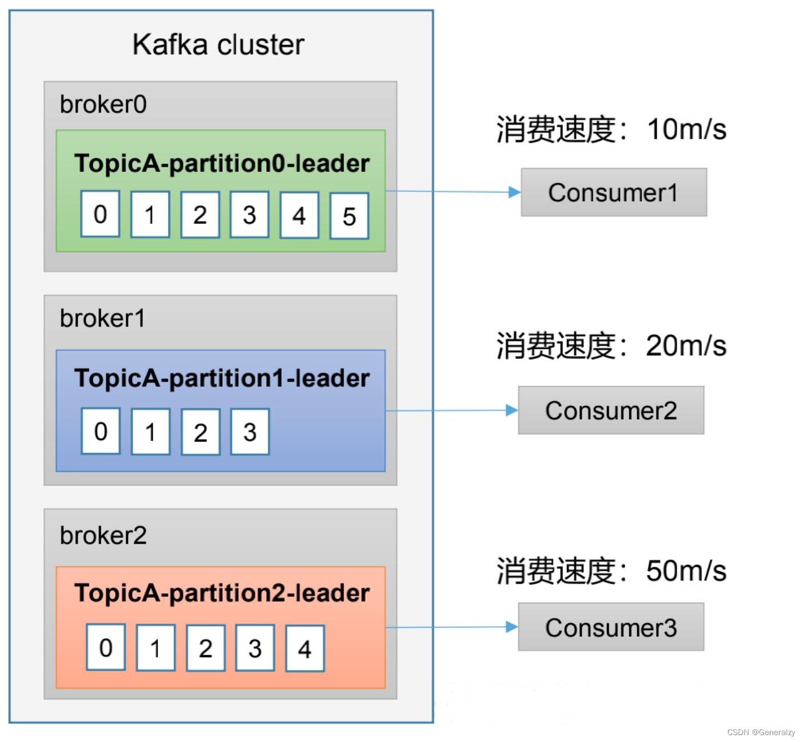

### Kafka 消费者工作流程

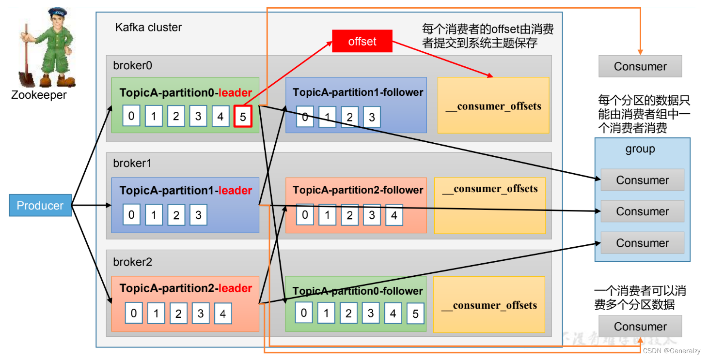

### 消费者组原理

**Consumer Group** （CG）：消费者组，由多个consumer组成。形成一个消费者组的条件是所有消费者的 [groupid](groupid) 相同。

- 消费者组内每个消费者负责消费不同分区的数据，一个分区只能由一个组内消费者消费。
- 消费者组之间互不影响。所有的消费者都属于某个消费者组，即消费者组是逻辑上的一个订阅者。

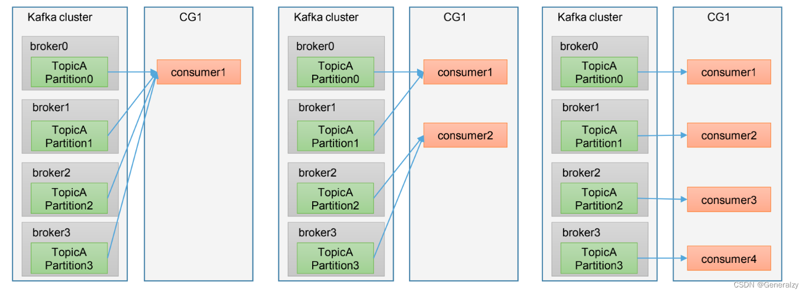

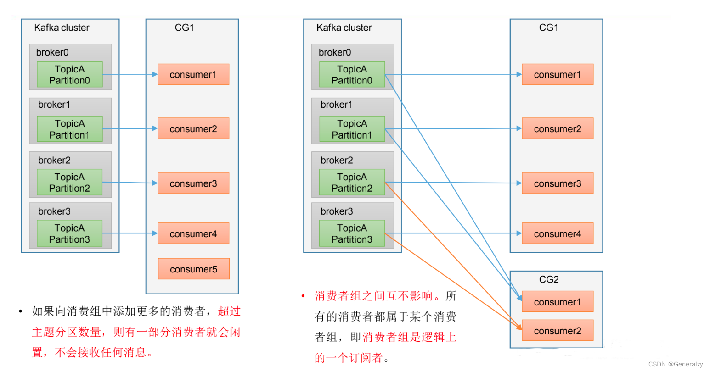

### 消费者重要参数

| 参数名称 | 描述 |
| :--- | :--- |
| [bootstrap.servers](bootstrap.servers) | 向 Kafka 集群建立初始连接用到的 host/port 列表。 |
| [key.deserializer](key.deserializer) 和 [value.deserializer](value.deserializer) | 指定接收消息的 key 和 value 的反序列化类型。一定要写全类名。 |
| [group.id](group.id) | 标记消费者所属的消费者组。 |
| [enable.auto.commit](enable.auto.commit) | 默认值为 true，消费者会自动周期性地向服务器提交偏移量。 |
| [auto.commit.interval.ms](auto.commit.interval.ms) | 如果设置了 [enable.auto.commit](enable.auto.commit) 的值为 true，则该值定义了消费者偏移量向 Kafka 提交的频率，默认 5s。 |
| [auto.offset.reset](auto.offset.reset) | 当 Kafka 中没有初始偏移量或当前偏移量在服务器中不存在（如，数据被删除了），该如何处理？<br>earliest：自动重置偏移量到最早的偏移量。<br>latest：默认，自动重置偏移量到最新的偏移量。<br>none：如果消费组原来的（previous）偏移量不存在，则向消费者抛异常。<br>anything：向消费者抛异常。 |
| [offsets.topic.num.partitions](offsets.topic.num.partitions) | `__consumer_offsets` 的分区数，默认是 50 个分区。 |
| [heartbeat.interval.ms](heartbeat.interval.ms) | Kafka 消费者和 coordinator 之间的心跳时间，默认 3s。该条目必须小于 [session.timeout.ms](session.timeout.ms)，也不应该高于 [session.timeout.ms](session.timeout.ms) 的 1/3。 |
| [session.timeout.ms](session.timeout.ms) | Kafka 消费者和 coordinator 之间连接超时时间，默认 45s。超过该值，该消费者被移除，消费者组执行再平衡。 |
| [max.poll.interval.ms](max.poll.interval.ms) | 消费者处理消息的最大时长，默认是 5 分钟。超过该值，该消费者被移除，消费者组执行再平衡。 |
| [fetch.min.bytes](fetch.min.bytes) | 默认 1 个字节。消费者获取服务器端一批消息最小的字节数。 |
| [fetch.max.wait.ms](fetch.max.wait.ms) | 默认 500ms。如果没有从服务器端获取到一批数据的最小字节数。该时间到，仍然会返回数据。 |
| [fetch.max.bytes](fetch.max.bytes) | 默认 Default: 52428800 (50 m)。消费者获取服务器端一批消息最大的字节数。如果服务器端一批次的数据大于该值 (50m) 仍然可以拉取回来这批数据，因此，这不是一个绝对最大值。一批次的大小受 [message.max.bytes](message.max.bytes) (broker config) or [max.message.bytes](max.message.bytes) (topic config) 影响。 |
| [max.poll.records](max.poll.records) | 一次 poll 拉取数据返回消息的最大条数，默认是 500 条。 |

### offset 位移

#### offset 的默认维护位置

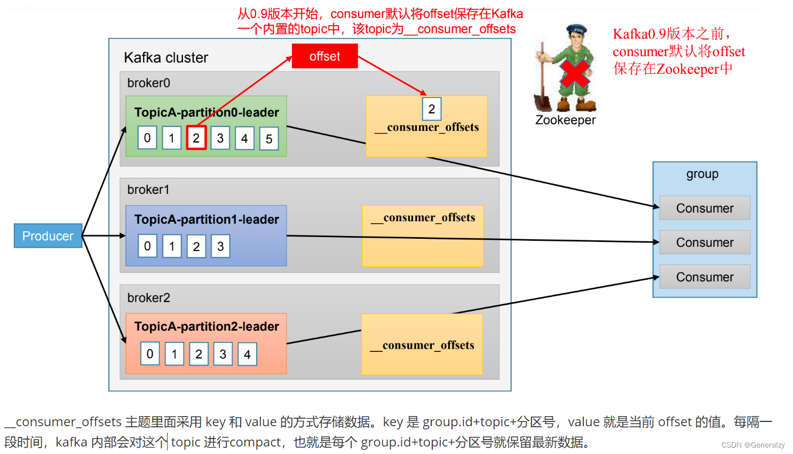

#### 自动提交 offset

为了使我们能够专注于自己的业务逻辑，Kafka提供了自动提交offset的功能。

自动提交offset的相关参数：

- [enable.auto.commit](enable.auto.commit)：是否开启自动提交offset功能，默认是true
- [auto.commit.interval.ms](auto.commit.interval.ms)：自动提交offset的时间间隔，默认是5s

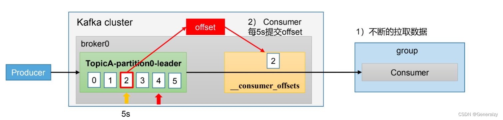

| 参数名称 | 描述 |
| :--- | :--- |
| [enable.auto.commit](enable.auto.commit) | 默认值为 true，消费者会自动周期性地向服务器提交偏移量。 |
| [auto.commit.interval.ms](auto.commit.interval.ms) | 如果设置了 [enable.auto.commit](enable.auto.commit) 的值为 true，则该值定义了消费者偏移量向 Kafka 提交的频率，默认 5s。 |

#### 手动提交 offset

虽然自动提交offset十分简单便利，但由于其是基于时间提交的，开发人员难以把握 offset 提交的时机。一次 Kafka 还提供了手动提交 offset 的API。

手动提交 offset 的方法有两种：分别是 [commitSync](commitSync)(同步提交)和[commitAsync](commitAsync)(异步提交)。两者的相同点是，都会将本次提交的一批数据最高的偏移量提交；不同点是，同步提交阻塞当前线程，一直到提交成功，并且会自动失败重试（由不可控因素导致，也会出现提交失败）；而异步提交则没有失败重试机制，故有可能提交失败。

- **commitSync**（同步提交）：必须等待offset提交完毕，再去消费下一批数据。
- **commitAsync**（异步提交）：发送完提交offset请求后，就开始消费下一批数据了。

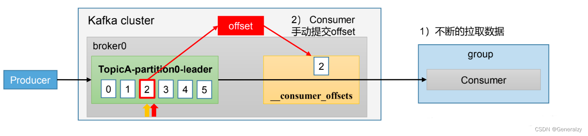

#### 指定 offset 消费

[auto.offset.reset](auto.offset.reset) = earliest \| latest \| none 默认是 latest。

当 Kafka 中没有初始偏移量（消费者组第一次消费）或服务器上不再存在当前偏移量时（例如该数据已被删除），该怎么办？

- **earliest**：自动将偏移量重置为最早的偏移量，–from-beginning。
- **latest**（默认值）：自动将偏移量重置为最新偏移量。
- **none**：如果未找到消费者组的先前偏移量，则向消费者抛出异常。

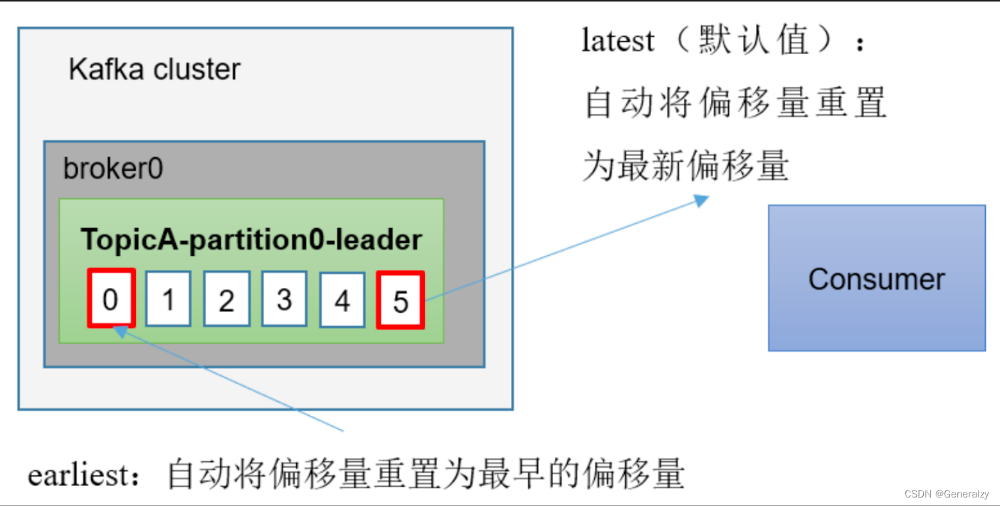

## Kafka-Kraft模式 🔧

### Kafka-Kraft架构

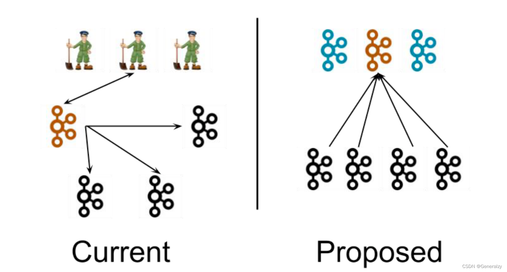

左图为 Kafka 现有架构，元数据在 zookeeper 中，运行时动态选举 controller，由controller 进行 Kafka 集群管理。右图为 kraft 模式架构（实验性），不再依赖 zookeeper 集群，而是用三台 controller 节点代替 zookeeper，元数据保存在 controller 中，由 controller 直接进行 Kafka 集群管理。

这样做的好处有以下几个：

1. Kafka 不再依赖外部框架，而是能够独立运行；
2. controller 管理集群时，不再需要从 zookeeper 中先读取数据，集群性能上升；
3. 由于不依赖 zookeeper，集群扩展时不再受到 zookeeper 读写能力限制；
4. controller 不再动态选举，而是由配置文件规定。这样我们可以有针对性的加强controller 节点的配置，而不是像以前一样对随机 controller 节点的高负载束手无策。