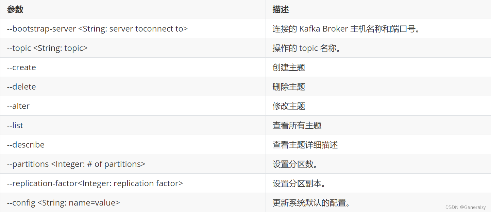
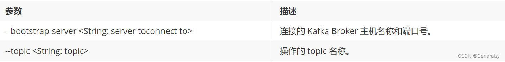
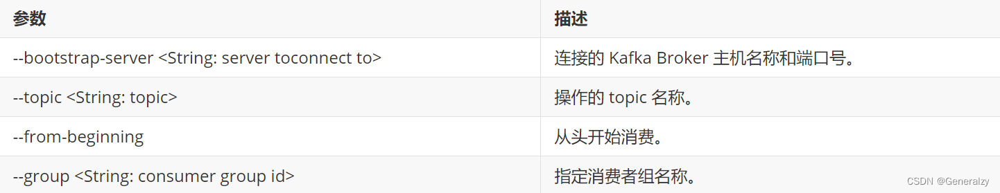

# Kafka 

## Kafka 命令行操作

- Kafka基础架构


### 主题命令行操作

1. 查看操作主题命令参数

```shell
./bin/kafka-topics.sh 
```




2. 查看当前服务器中的所有topic

```shell
./bin/kafka-topics.sh --bootstrap-server localhost:9092 --list
```

3. 创建 `first topic`

```shell
./bin/kafka-topics.sh --bootstrap-server localhost:9092 --create --partitions 1 --replication-factor 1 --topic first
```

- topic 定义 topic 名
- replication-factor 定义副本数
- partitions 定义分区数

4. 查看 `first` 主题的详情

```shell
./bin/kafka-topics.sh --bootstrap-server localhost:9092 --topic first --describe
```

5. 修改分区数（注意：分区数只能增加，不能减少）

```shell
./bin/kafka-topics.sh --bootstrap-server localhost:9092 --alter --topic first --partitions 3
```

6. 查看结果

```shell
./bin/kafka-topics.sh --bootstrap-server localhost:9092 --topic first --describe 
Topic: first	TopicId: _Pjhmn1NTr6ufGufcnsw5A	PartitionCount: 3	ReplicationFactor: 1	Configs: segment.bytes=1073741824
	Topic: first	Partition: 0	Leader: 0	Replicas: 0	Isr: 0
	Topic: first	Partition: 1	Leader: 0	Replicas: 0	Isr: 0
	Topic: first	Partition: 2	Leader: 0	Replicas: 0	Isr: 0
```

7. 删除 `topic`

```shell
./bin/kafka-topics.sh --bootstrap-server localhost:9092 --delete --topic first 
```

### 生产者命令行操作

1. 查看操作者命令参数

```shell
./bin/kafka-console-producer.sh 
```



2. 发送消息

```shell
./bin/kafka-console-producer.sh --bootstrap-server localhost:9092 --topic first
>hello world
>yooome yooome
```

### 消费者命令行操作

1. 查看操作消费者命令参数

```shell
./bin/kafka-console-consumer.sh
```



2. 消费消息

- 消费 `first` 主题中的数据

```shell
./bin/kafka-console-consumer.sh --bootstrap-server localhost:9092 --topic first
```

- 把主题中所有的数据都读取出来（包括历史数据）

```shell
./bin/kafka-console-consumer.sh --bootstrap-server localhost:9092 --from-beginning --topic first
```


