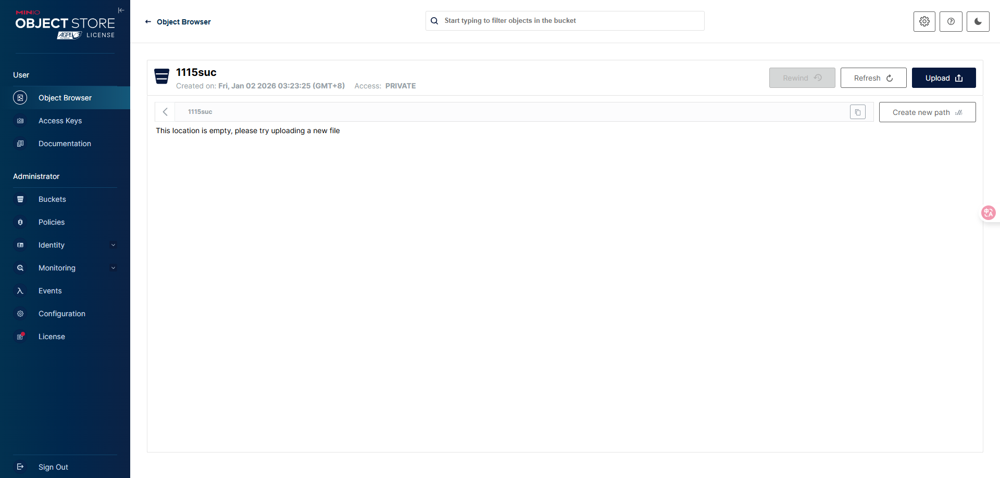
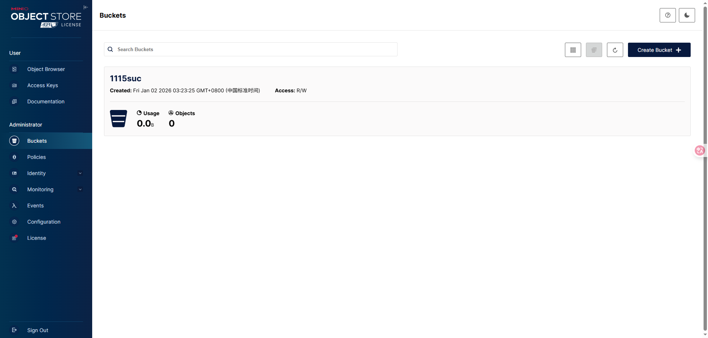
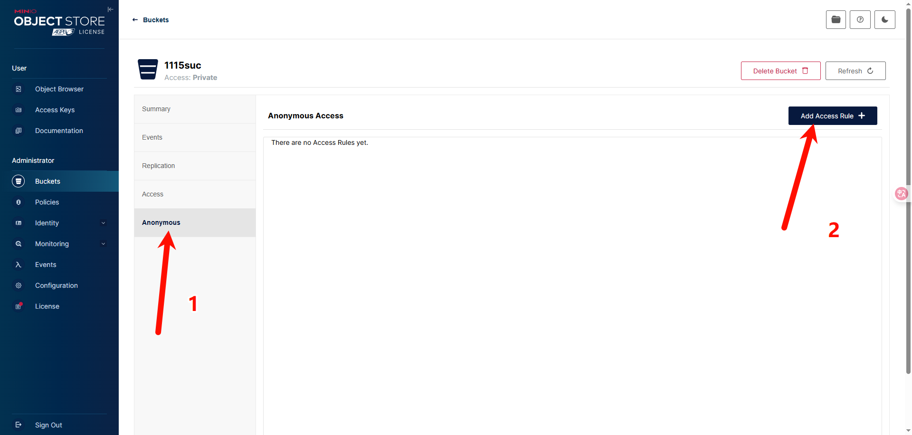
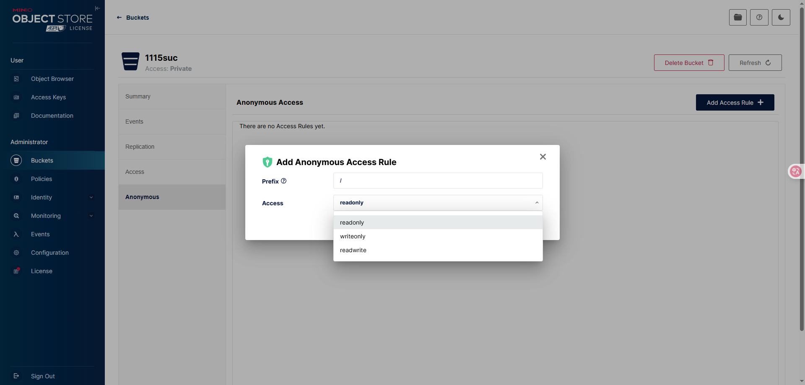

# MinIO 新版

## Minio 使用

### 一、安装MinIO

#### 1.拉去 MinIO 镜像

```shell
docker pull minio/minio:RELEASE.2025-04-22T22-12-26Z
```

#### 2.创建 MinIO 容器

```shell
sudo docker run \
    -p 9000:9000 \
    -p 9090:9090 \
    --name minio \
    --restart=always \
    -e "MINIO_ACCESS_KEY=minio" \
    -e "MINIO_SECRET_KEY=bo@DwF1mzr_wF7am" \
    -v /home/data:/data \
    -v /home/config:/root/.minio \
    -d \
    minio/minio:RELEASE.2025-04-22T22-12-26Z \
    server /data \
    --address ":9000" --console-address ":9090"
```

- server /data: 这是传递给 MinIO 镜像的命令和参数。server 是 MinIO 的命令，用于启动 MinIO 服务，/data 是 MinIO 存储数据的目录（/data 是容器内的目录）
- --address ":9000": 这个参数指定了 MinIO 服务器监听的地址和端口，这里指定的是容器内的 9000 端口
- --console-address ":9090": 这个参数指定了 MinIO 控制台（Web 界面）监听的地址和端口，这里指定的是容器内的 9090 端口

### 二、使用 MinIO

- 访问 MinIO 控制台: http://127.0.0.1:9090



#### 1.引入依赖

```xml
    <dependency>
        <groupId>io.minio</groupId>
        <artifactId>minio</artifactId>
        <version>8.5.10</version>
    </dependency>
```

#### 2.创建 MinioAutoConfiguration

```java
@Configuration
@EnableConfigurationProperties(MinioConfigurationProperties.class)
public class MinioAutoConfiguration {
    private final MinioConfigurationProperties minioConfigurationProperties;

    public MinioAutoConfiguration(MinioConfigurationProperties minioConfigurationProperties) {
        this.minioConfigurationProperties = minioConfigurationProperties;
    }

    @Bean
    public MinioClient minioClient() {
        return MinioClient
                .builder()
                .credentials(minioConfigurationProperties.getAccessKey(), minioConfigurationProperties.getSecretKey())
                .endpoint(minioConfigurationProperties.getEndpoint())
                .build();
    }

    @Bean
    public MinioFileStorageUtil minioFileStorageService(MinioClient minioClient, MinioConfigurationProperties minioConfigurationProperties) {
        return new MinioFileStorageUtil(minioClient, minioConfigurationProperties);
    }
}
```

#### 3.创建 MinioConfigurationProperties

```java
@ConfigurationProperties(prefix = "minio")
@Data
public class MinioConfigurationProperties {
    private String endpoint;
    private String accessKey;
    private String secretKey;
    private String bucket;
}
```

#### 4.spring 配置依赖

```xml
    <dependency>
        <groupId>org.springframework.boot</groupId>
        <artifactId>spring-boot-configuration-processor</artifactId>
    </dependency>
```

- `resources/META-INF/spring` 目录下创建 `org.springframework.boot.autoconfigure.AutoConfiguration.imports` 文件

```text
course.minio.MinioAutoConfiguration
```

#### 5.创建 MinioFileStorageUtil
```java
@Slf4j
@RequiredArgsConstructor
@EnableConfigurationProperties(MinioConfigurationProperties.class)
@Import(MinioAutoConfiguration.class)
public class MinioFileStorageUtil {
    private final MinioClient minioClient;
    private final MinioConfigurationProperties minioConfigurationProperties;
    private final static String separator = "/";
}
```

#### 6.使用 MinioFileStorageUtil

- 构建文件路径

```java
    public String buildFilePath(String path, String filename) {
        StringBuilder stringBuilder = new StringBuilder(50);
        if (path != null && !path.isEmpty()) {
            stringBuilder.append(path).append(separator);
        }
        SimpleDateFormat simpleDateFormat = new SimpleDateFormat("yyyy/MM/dd");
        String todayString = simpleDateFormat.format(new Date());
        stringBuilder.append(todayString)
                .append(separator)
                .append(filename);
        return stringBuilder.toString();
    }
```

- 上传图片文件(jpg)

```java
    public String uploadImageFile(String prefix, String filename, InputStream inputStream) {
        String filePath = buildFilePath(prefix, filename);
        try {
            PutObjectArgs putObjectArgs = PutObjectArgs.builder()
                    .object(filePath)
                    .contentType("image/jpg")
                    .bucket(minioConfigurationProperties.getBucket()).stream(inputStream, inputStream.available(), -1)
                    .build();
            minioClient.putObject(putObjectArgs);

            return minioConfigurationProperties.getEndpoint() + separator + minioConfigurationProperties.getBucket() + separator + filePath;
        } catch (Exception e) {
            log.error("Minio put file error.", e);
            throw new RuntimeException("Minio put file error.");
        }
    }
```

- 上传html文件

```java
    public String uploadHtmlFile(String prefix, String filename, InputStream inputStream) {
        String filePath = buildFilePath(prefix, filename);
        try {
            PutObjectArgs putObjectArgs = PutObjectArgs.builder()
                    .object(filePath)
                    .contentType("text/html")
                    .bucket(minioConfigurationProperties.getBucket()).stream(inputStream, inputStream.available(), -1)
                    .build();
            minioClient.putObject(putObjectArgs);
            return minioConfigurationProperties.getEndpoint() + separator + minioConfigurationProperties.getBucket() + separator + filePath;
        } catch (Exception e) {
            log.error("Minio put file error.", e);
            throw new RuntimeException("Minio put file error.");
        }
    }
```

- 上传mp4文件

```java
    public String uploadMp4File(String prefix, String filename, InputStream inputStream) {
        String filePath = buildFilePath(prefix, filename);
        try {
            PutObjectArgs putObjectArgs = PutObjectArgs.builder()
                    .object(filePath)
                    .contentType("video/mp4")
                    .bucket(minioConfigurationProperties.getBucket()).stream(inputStream, inputStream.available(), -1)
                    .build();
            minioClient.putObject(putObjectArgs);
            return minioConfigurationProperties.getEndpoint() + separator + minioConfigurationProperties.getBucket() + separator + filePath;
        } catch (Exception e) {
            log.error("Minio put file error.", e);
            throw new RuntimeException("Minio put file error.");
        }
    }
```

- 上传文件，由 MinIO 自动推断文件类型

```java
    public String uploadFile(String prefix, String filename, InputStream inputStream) {
        String filePath = buildFilePath(prefix, filename);
        try {
            PutObjectArgs putObjectArgs = PutObjectArgs.builder()
                    .object(filePath)
                    .bucket(minioConfigurationProperties.getBucket()).stream(inputStream, inputStream.available(), -1)
                    .build();
            minioClient.putObject(putObjectArgs);
            return minioConfigurationProperties.getEndpoint() + separator + minioConfigurationProperties.getBucket() + separator + filePath;
        } catch (Exception e) {
            log.error("Minio put file error.", e);
            throw new RuntimeException("Minio put file error.");
        }
    }
```

- 删除文件

```java
    public void deleteFile(String pathUrl) {
        String key = pathUrl.replace(minioConfigurationProperties.getEndpoint() + separator, "");
        int index = key.indexOf(separator);
        String bucket = key.substring(0, index);
        String filePath = key.substring(index + 1);

        RemoveObjectArgs removeObjectArgs = RemoveObjectArgs.builder()
                .bucket(bucket)
                .object(filePath)
                .build();

        try {
            minioClient.removeObject(removeObjectArgs);
        } catch (Exception e) {
            log.error("minio remove file error.  pathUrl:{}", pathUrl);
            throw new RuntimeException("Minio remove file error.  pathUrl:" + pathUrl);
        }
    }
```

- 下载文件

```java
    public byte[] downloadFile(String pathUrl) {
        String key = pathUrl.replace(minioConfigurationProperties.getEndpoint() + separator, "");
        int index = key.indexOf(separator);
        String filePath = key.substring(index + 1);
        InputStream inputStream;

        try {
            GetObjectArgs getObjectArgs = GetObjectArgs.builder()
                    .bucket(minioConfigurationProperties.getBucket())
                    .object(filePath)
                    .build();
            inputStream = minioClient.getObject(getObjectArgs);
        } catch (Exception e) {
            log.error("Minio down file error.  pathUrl:{}", pathUrl);
            throw new RuntimeException("Minio down file error.  pathUrl:" + pathUrl);
        }

        ByteArrayOutputStream byteArrayOutputStream = new ByteArrayOutputStream();
        byte[] buffer = new byte[1024];
        int returnCode = 0;
        while (true) {
            try {
                if (inputStream != null && !((returnCode = inputStream.read(buffer, 0, 1024)) > 0)) {
                    break;
                }
            } catch (IOException e) {
                throw new RuntimeException("Minio transfer file to byte array failed.");
            }
            byteArrayOutputStream.write(buffer, 0, returnCode);
        }

        return byteArrayOutputStream.toByteArray();
    }
```

### 三、开放 MinIO 匿名访问权限







