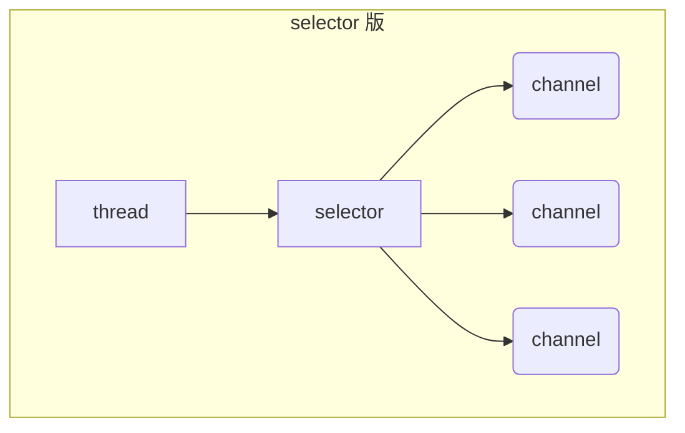

# 🚀 NIO 笔记

## 一、三大核心组件 🧩

### 1. Channel & Buffer 🔗

- `channel` 有一点类似于 `stream`，它就是读写数据的**双向通道**，可以从 `channel` 将数据读入 `buffer`，也可以将 `buffer` 的数据写入 `channel`，而之前的 `stream` 要么是输入，要么是输出，`channel` 比 `stream` 更为底层


常见 `Channel` 类型：

- **FileChannel** - 文件操作通道
- **DatagramChannel** - UDP网络通信通道
- **SocketChannel** - TCP客户端通道
- **ServerSocketChannel** - TCP服务端通道

> 💡 **小提示**: Channel 是双向的，可以同时进行读写操作

`buffer` 则用来缓冲读写数据，常见的 `buffer` 有：

- **ByteBuffer** (最常用)
  - MappedByteBuffer - 内存映射缓冲区
  - DirectByteBuffer - 直接缓冲区
  - HeapByteBuffer - 堆缓冲区
- **ShortBuffer** - 短整型缓冲区
- **IntBuffer** - 整型缓冲区
- **LongBuffer** - 长整型缓冲区
- **FloatBuffer** - 浮点型缓冲区
- **DoubleBuffer** - 双精度浮点型缓冲区
- **CharBuffer** - 字符缓冲区

### 2. Selector 🎯

- `Selector` 是一个多路复用器，`Selector` 可以同时监控多个 `channel`，当某个 `channel` 上的数据可以读写时，`Selector` 就会返回这个 `channel`，从而实现非阻塞 IO




> 🔍 **工作原理**: 调用 selector 的 select() 会阻塞直到 channel 发生了读写就绪事件，这些事件发生，select 方法就会返回这些事件交给 thread 来处理

> ⚡ **优势**: 一个线程可以管理多个连接，提高系统效率

## 二、ByteBuffer 详解 📦

### 1. 基本使用方法

```java
@Slf4j
public class ByteBufferDemo {
    public static void main(String[] args) {
        try (RandomAccessFile file = new RandomAccessFile("helloword/data.txt", "rw")) {
            FileChannel channel = file.getChannel();
            ByteBuffer buffer = ByteBuffer.allocate(10);
            do {
                // 向 buffer 写入
                int len = channel.read(buffer);
                log.debug("读到字节数：{}", len);
                if (len == -1) {
                    break;
                }
                // 切换 buffer 读模式
                buffer.flip();
                while(buffer.hasRemaining()) {
                    log.debug("{}", (char)buffer.get());
                }
                // 切换 buffer 写模式
                buffer.clear();
            } while (true);
        } catch (IOException e) {
            e.printStackTrace();
        }
    }
}
```


**核心操作流程**：

1. 📥 向 buffer 写入数据，例如调用 channel.read(buffer)
2. 🔄 调用 flip() 切换至**读模式**
3. 📤 从 buffer 读取数据，例如调用 buffer.get()
4. 🔄 调用 clear() 或 compact() 切换至**写模式**
5. 🔁 重复 1~4 步骤

### 2. ByteBuffer 的内部结构 🏗️

ByteBuffer 有以下重要属性：

- **capacity** - 容量，缓冲区的总大小
- **position** - 位置，当前读写位置
- **limit** - 限制，读写的边界

**初始状态**：


**写模式下**，position 是写入位置，limit 等于容量，下图表示写入了 4 个字节后的状态：


**flip 动作发生后**，position 切换为读取位置，limit 切换为读取限制：


**读取 4 个字节后**，状态：


**clear 动作发生后**，状态：


**compact 方法**，是把未读完的部分向前压缩，然后切换至写模式：


### 3. ByteBuffer 常见方法 🛠️

#### (1). 分配空间 🏗️

- 可以使用 allocate 方法为 ByteBuffer 分配空间 (堆缓冲区)

```java
    ByteBuffer buffer = ByteBuffer.allocate(1024);
```


- allocateDirect 方法为 DirectByteBuffer 分配空间 (直接缓冲区)

```java
    ByteBuffer buffer = ByteBuffer.allocateDirect(1024);
```


> 💡 **区别**: 直接缓冲区在堆外分配，适合频繁的IO操作；堆缓冲区在JVM堆内分配，受GC管理

#### (2). 写入数据 📥

- 调用 channel 的 read 方法

```java
    int readBytes = channel.read(buf);
```


- 调用 buffer 自己的 put 方法

```java
    buf.put((byte)127);
```


#### (3). 读取数据 📤

- 调用 channel 的 write 方法

```java
    int writeBytes = channel.write(buf);
```


- 调用 buffer 自己的 get 方法

```java
    byte b = buf.get();
```


get 方法会让 position 读指针向后走，如果想重复读取数据：

- 可以调用 rewind 方法将 position 重新置为 0
- 或者调用 get(int i) 方法获取索引 i 的内容，它不会移动读指针

#### (4). 切换模式 🔄

- 调用 flip() 方法切换至读模式
- 调用 clear() 方法切换至写模式
- 调用 compact() 方法切换至写模式，但数据未读完，数据会被向前压缩

#### (5). mark 和 reset 🎯

- mark 是在读取时，做一个标记，即使 position 改变，只要调用 reset 就能回到 mark 的位置

> ⚠️ 注意: rewind 和 flip 都会清除 mark 位置

#### (6). 字符串与 ByteBuffer 互转 🔄

- 调用 getBytes() 方法

```java
    byte[] bytes = "hello".getBytes();
    ByteBuffer buffer = ByteBuffer.allocate(1024);
    buffer.put(bytes);
```


- 调用 wrap() 方法

```java
    ByteBuffer buffer = ByteBuffer.wrap("hello".getBytes());
```


- Charset

```java
    ByteBuffer buffer = StandardCharsets.UTF_8.encode("hello");
```


> 💡 **提示**: 使用 wrap() 和 Charset 后，position 读指针和 limit 读限制会自动设置
> 使用 getBytes() 方法后，position 读指针不会自动设置，需要手动调用 flip() 设置

#### (7). Buffer 的线程安全 🔒

- Buffer 是**非线程安全的**，不能在多个线程之间共享

### 4. Scattering Reads 分散读取 📚

- 分散读取是指从 channel 中读取数据到多个 buffer 中

```java
    try (RandomAccessFile file = new RandomAccessFile("helloword/3parts.txt", "rw")) {
        FileChannel channel = file.getChannel();
        ByteBuffer a = ByteBuffer.allocate(3);
        ByteBuffer b = ByteBuffer.allocate(3);
        ByteBuffer c = ByteBuffer.allocate(5);
        channel.read(new ByteBuffer[]{a, b, c});
    } catch (IOException e) {
        e.printStackTrace();
    }
```


> 🎯 **应用场景**: 适合处理结构化数据，如消息头、消息体等

### 5. Gathering Writes 聚集写入 ✍️

- 聚集写入是指将多个 buffer 的数据写入 channel

```java
    try (RandomAccessFile file = new RandomAccessFile("helloword/3parts.txt", "rw")) {
    FileChannel channel = file.getChannel();
    ByteBuffer d = ByteBuffer.allocate(4);
    ByteBuffer e = ByteBuffer.allocate(4);
    channel.position(11);

    d.put(new byte[]{'f', 'o', 'u', 'r'});
    e.put(new byte[]{'f', 'i', 'v', 'e'});
    channel.write(new ByteBuffer[]{d, e});
    } catch (IOException e) {
        e.printStackTrace();
}
```


## 三、文件编程 📁

### 1. FileChannel 详解

#### (1). FileChannel 的工作模式 ⚙️

- FileChannel 只能工作在阻塞模式下

#### (2). FileChannel 的获取 🔑

不能直接打开 FileChannel，必须通过 FileInputStream、FileOutputStream 或者 RandomAccessFile 来获取 FileChannel，它们都有 getChannel 方法

- 通过 FileInputStream 获取的 channel 只能读
- 通过 FileOutputStream 获取的 channel 只能写
- 通过 RandomAccessFile 是否能读写根据构造 RandomAccessFile 时的读写模式决定

#### (3). FileChannel 的数据读取 📥

- 会从 channel 读取数据填充 ByteBuffer，返回值表示读到了多少字节，-1 表示到达了文件的末尾

```java
    int readBytes = channel.read(buffer);
```


#### (4). FileChannel 的数据写入 ✍️

- 在 while 中调用 channel.write 是因为 write 方法并不能保证一次将 buffer 中的内容全部写入 channel

```java
    while(buffer.hasRemaining()) {
        channel.write(buffer);
    }
```


#### (5). FileChannel 的关闭 🚪

- channel 必须关闭，不过调用了 FileInputStream、FileOutputStream 或者 RandomAccessFile 的 close 方法会间接地调用 channel 的 close 方法

#### (6). FileChannel 的数据位置 📍

- 获取当前位置

```java
    long position = channel.position();
```


- 设置当前位置

```java
    channel.position(position);
```


- 获取文件大小

```java
    long size = channel.size();
    channel.truncate(size); // 截断文件
    channel.force(true);  // 强制将数据写入磁盘,否则数据是在缓存中，不会写入磁盘
 ```


### 2. 两个 Channel 传输数据 🚚

```java
public class TestFileChannelTransferTo {
    public static void main(String[] args) {
        try (
                FileChannel from = new FileInputStream("data.txt").getChannel();
                FileChannel to = new FileOutputStream("to.txt").getChannel();
        ) {
            // 效率高，底层会利用操作系统的零拷贝进行优化
            long size = from.size();
            // left 变量代表还剩余多少字节
            for (long left = size; left > 0; ) {
                System.out.println("position:" + (size - left) + " left:" + left);
                left -= from.transferTo((size - left), left, to);
            }
        } catch (IOException e) {
            e.printStackTrace();
        }
    }
}
```


> ⚡ **零拷贝**: transferTo() 方法利用操作系统的零拷贝机制，效率更高

### 3. Path 路径操作 🛣️

- Path 用来表示文件路径
- Paths 是工具类，用来获取 Path 实例

```java
    Path source = Paths.get("1.txt"); // 相对路径 使用 user.dir 环境变量来定位 1.txt
    Path source = Paths.get("d:\\1.txt"); // 绝对路径 代表了  d:\1.txt
    Path source = Paths.get("d:/1.txt"); // 绝对路径 同样代表了  d:\1.txt
    Path projects = Paths.get("d:\\data", "projects"); // 代表了  d:\data\projects
```


### 4. Files 工具类 🧰

- Files 是工具类，用来操作文件

#### (1). 检查文件是否存在 🔍

```java
    boolean exists = Files.exists(Paths.get("1.txt")); 
```


#### (2). 创建文件 🏗️

- 创建一级目录

```java
    Path path = Paths.get("helloword/d1");
    Files.createDirectory(path);
```


> ⚠️ 如果目录已存在，会抛异常 FileAlreadyExistsException       
> ❌ 不能一次创建多级目录，否则会抛异常 NoSuchFileException

- 创建多级目录

```java
    Path path = Paths.get("helloword/d1/d2");
    Files.createDirectories(path);
```


#### (3). 拷贝文件 📋

```java
    Path source = Paths.get("helloword/data.txt");
    Path target = Paths.get("helloword/target.txt");
    
    Files.copy(source, target);
```


> ⚠️ 如果目标文件已存在，会抛异常 FileAlreadyExistsException       
> 🔄 如果希望用 source 覆盖掉 target，需要用 StandardCopyOption 来控制        
> `Files.copy(source, target, StandardCopyOption.REPLACE_EXISTING);`

#### (4). 移动文件 🚚

```java
    Path source = Paths.get("helloword/data.txt");
    Path target = Paths.get("helloword/data.txt");
    
    Files.move(source, target, StandardCopyOption.ATOMIC_MOVE);
```


> 🔒 StandardCopyOption.ATOMIC_MOVE 保证文件移动的原子性

#### (5). 删除文件 🗑️

```java
    Path target = Paths.get("helloword/target.txt");
    
    Files.delete(target);
```


> ⚠️ 如果文件不存在，会抛异常 NoSuchFileException

#### (6). 删除目录 🗑️

```java
    Path target = Paths.get("helloword/d1");
    
    Files.delete(target);
```


> ⚠️ 如果目录还有内容，会抛异常 DirectoryNotEmptyException

#### (7). 遍历目录 🌳

```java
public static void main(String[] args) throws IOException {
    Path path = Paths.get("C:\\Program Files\\Java\\jdk1.8.0_91");
    AtomicInteger dirCount = new AtomicInteger();
    AtomicInteger fileCount = new AtomicInteger();
    Files.walkFileTree(path, new SimpleFileVisitor<Path>() {
        @Override
        public FileVisitResult preVisitDirectory(Path dir, BasicFileAttributes attrs) throws IOException {
          System.out.println(dir);
          dirCount.incrementAndGet();
          return super.preVisitDirectory(dir, attrs);
        }
    
        @Override
        public FileVisitResult visitFile(Path file, BasicFileAttributes attrs) throws IOException {
          System.out.println(file);
          fileCount.incrementAndGet();
          return super.visitFile(file, attrs);
        }
    
        @Override
        public FileVisitResult visitFileFailed(Path file, IOException exc) {
          return super.visitFileFailed(file, exc);
        }
    
        @Override
        public FileVisitResult postVisitDirectory(Path dir, IOException exc) {
          return super.postVisitDirectory(dir, exc);
        }
    });
    System.out.println(dirCount); // 133
    System.out.println(fileCount); // 1479
}
```


> 💡 **SimpleFileVisitor**: 提供了文件遍历的默认实现，可以重写特定方法来处理不同情况