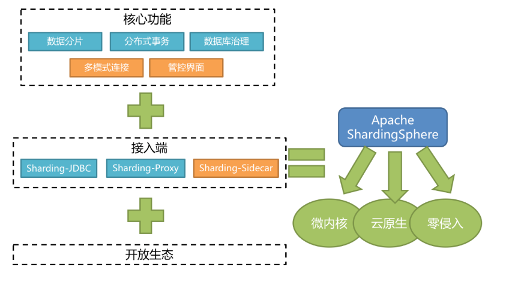
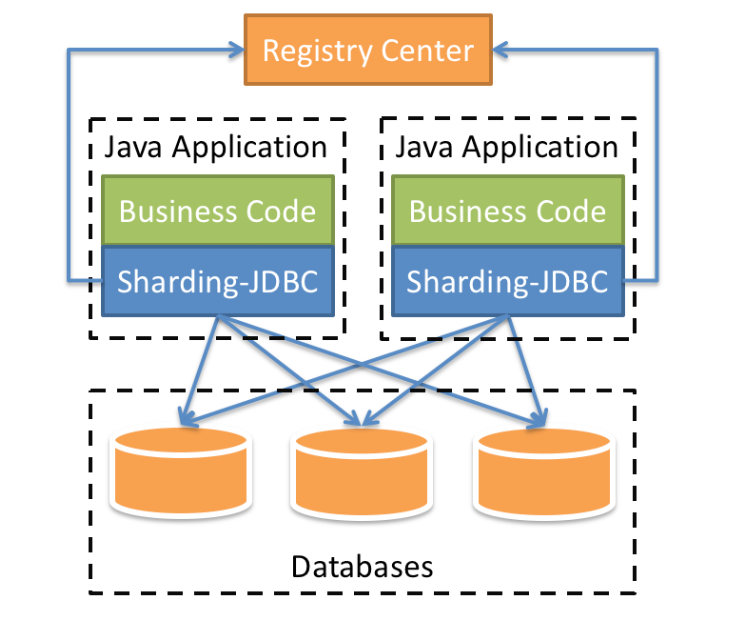
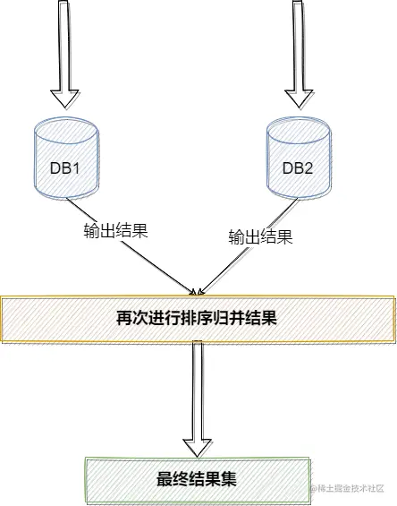

# Sharding-JDBC 📚

## 📖 Sharding-JDBC 介绍

- Sharding-JDBC是当当网研发的开源分布式数据库中间件，定位为轻量级Java框架，在Java的JDBC层提供的额外服务。 它使用客户端直连数据库，以jar包形式提供服务，无需额外部署和依赖，可理解为增强版的JDBC驱动，完全兼容JDBC和各种ORM框架，从3.0开始Sharding-JDBC被包含在Sharding-Sphere中。

- ShardingSphere是一套开源的分布式数据库中间件解决方案组成的生态圈，它由Sharding-JDBC、Sharding-Proxy和Sharding-Sidecar（计划中）这3款相互独立的产品组成。 他们均提供标准化的数据分片、分布式事务和数据库治理功能，可适用于如Java同构、异构语言、云原生等各种多样化的应用场景

## 🎯 Sharding-JDBC的作用

Sharding-JDBC的核心功能为数据分片和读写分离，通过Sharding-JDBC,应用可以透明的使用Jdbc访问已经分库分表、读写分离的多个数据源，而不用关心数据源的数量以及数据如何分布。

- 适用于任何基于JDBC的ORM框架，如：JPA, Hibernate, Mybatis, Spring JDBC Template或直接使用JDBC。
- 支持任何第三方的数据库连接池，如：DBCP, C3P0, BoneCP, Druid, HikariCP等。
- 支持任意实现JDBC规范的数据库。目前支持MySQL，Oracle，SQLServer，PostgreSQL以及任何遵循SQL92标准的数据库。

## 🚧 分库分表带来的问题

分库分表能有效的缓解了单机和单库带来的性能瓶颈和压力，突破网络IO、硬件资源、连接数的瓶颈，同时也带来了一些问题。

### 事务一致性问题 🔄

- 由于分库分表把数据分布在不同库甚至不同服务器，不可避免会带来分布式事务问题。

### 跨节点关联查询 🔗

- 在没有分库前，比如说我们要在文章中去嵌入一个商品信息，那么可以通过文章中的商品ID进行关联查询获取到商品详情，但是此时我们发现，商品和文章已经经过分库分表，不在同一个数据库，甚至部署在不同的服务器上，无法进行关联查询

### 跨节点分页、排序函数 📊

- 跨节点多库进行查询时，limit分页、order by排序等问题，就变得比较复杂了。需要先在不同的分片节点中将数据进行排序并返回，然后将不同分片返回的结果集进行汇总和再次排序。

### 全局主键避重问题 🔢

- 单库单表一般都是使用的自增主键，但是在切分之后每个自增主键将无法使用，因为这样会导致数据主键重复，因此必须重新设计主键。

## 📋 Sharding-JDBC 中的一些概念

### 逻辑表 📐

- 在对表进行分片后，一张表分成了n个表，比如订单表`t_order`分成如下三张表：`t_order_1`，`t_order_2`，`t_order_3`
- 此时订单表的逻辑表就是`t_order`，Sharding-JDBC 在进行分片规则配置时针对的就是这张逻辑表

### 真实表 📐

- 上述`t_order_1`，`t_order_2`，`t_order_3` 称之为 真实表

### 数据节点 💾

- 数据分片的最小单元，由数据源名称和表名称组成，比如：ds1.t_order_1

### 分片键 🔑

- 用于分片的数据库字段，是将数据库(表)水平拆分的关键字段。例：将订单表中的订单主键的尾数取模分片，则订单主键为分片字段。 SQL中如果无分片字段，将执行全路由，性能较差。 除了对单分片字段的支持，Sharding-Jdbc 也支持根据多个字段进行分片。

### 分片算法 🧮

- 通过分片算法将数据分片，支持通过 `=` 、 `BETWEEN` 和 `IN` 分片。
- 分片算法需要应用方开发者自行实现，可实现的灵活度非常高。包括：精确分片算法 、范围分片算法 ，复合分片算法等。例如：where order_id = ? 将采用精确分片算法，where order_id in (?,?,?)将采用精确分片算法，where order_id BETWEEN ? and ? 将采用范围分片算法，复合分片算法用于分片键有多个复杂情况。

> Sharding-JDBC 中的分片算法需要开发者根据业务自定义

### 分片策略 📋

- 包含分片键和分片算法，由于分片算法的独立性，将其独立抽离。真正可用于分片操作的是分片键 + 分片算法，也就是分片策略。
- 内置的分片策略大致可分为尾数取模、哈希、范围、标签、时间等。由用户方配置的分片策略则更加灵活，常用的使用行表达式配置分片策略，它采用 Groovy 表达式表示，如: t_user_$->{u_id % 8} 表示t_user 表根据u_id模8，而分成8张表，表名称为 t_user_0 到 t_user_7 。

#### 1. 标准分片策略 ⚖️

- 标准分片策略适用于单分片键，此策略支持 `PreciseShardingAlgorithm` 和 `RangeShardingAlgorithm` 两个分片算法。
- 其中 `PreciseShardingAlgorithm` 是必选的，用于处理 = 和 IN 的分片。`RangeShardingAlgorithm` 是可选的，用于处理`BETWEEN AND`， `>`， `<`，`>=`，`<=` 条件分片，`如果不配置RangeShardingAlgorithm`，SQL中的条件等将按照全库路由处理。

#### 2. 复合分片策略 🔄

- 复合分片策略，同样支持对 SQL语句中的 `=`，`>`， `<`， `>=`， `<=`，`IN` 和 `BETWEEN AND` 的分片操作。不同的是它支持多分片键，具体分配片细节完全由应用开发者实现。

#### 3. 行表达式分片策略 📝

- 行表达式分片策略，支持对 SQL语句中的 `=` 和 `IN` 的分片操作，但只支持单分片键。这种策略通常用于简单的分片，不需要自定义分片算法，可以直接在配置文件中接着写规则。
- `t_order_$->{t_order_id % 4}` 代表 `t_order` 对其字段 `t_order_id` 取模，拆分成4张表，而表名分别是 `t_order_0` 到 `t_order_3`。

#### 4. Hint分片策略 💡

- `Hint` 分片策略，对应上边的 `Hint` 分片算法，通过指定分片健而非从 SQL 中提取分片健的方式进行分片的策略。

### 分布式主键生成策略 🆔

- 通过在客户端生成自增主键替换以数据库原生自增主键的方式，做到分布式主键无重复。

> Sharding-JDBC 内部支持UUID和Snowflake生成分布式主键
