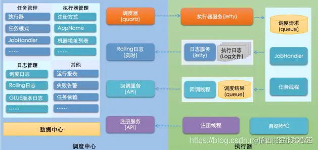
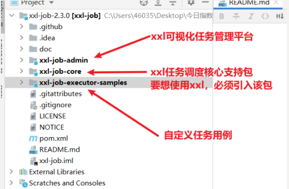

# 🍃 XXL-JOB 定时任务框架

## 🏗️ XXL-JOB 整体架构



## 🔧 部署 XXL-JOB

### 🚀 启动项目并访问

#### IDEA导入xxl-job工程



#### 初始化数据库


> ⚠️ 如果表 `xxl_job_registry` 导入过程报 `Specified key was too long; max key length is 767 bytes` 错误，则将 `i_g_k_v` 联合索引相关字段的 `varchar` 改小一些即可；

#### Docker安装任务管理中心

- 拉取 `xxl-job-admin` 任务中心镜像：

```shell
docker pull xuxueli/xxl-job-admin:2.3.0
```


- 启动 `xxl-job` 任务中心容器：

```shell
docker run -e PARAMS="--spring.datasource.url=jdbc:mysql://192.168.88.128:3306/xxl_job?useUnicode=true&characterEncoding=UTF-8&autoReconnect=true&serverTimezone=UTC --spring.datasource.username=root --spring.datasource.password=24364726" \
       -p 8093:8080  -v $PWD/xxldata:/data/applogs \
       --name=xxl-job-admin -d xuxueli/xxl-job-admin:2.3.0
```


- 访问任务中心：

```http
http://192.168.88.128:8093/xxl-job-admin
```


## 🔧 XXL-JOB 项目集成

### 📦 引入依赖

```xml
<dependency>
    <groupId>com.xuxueli</groupId>
    <artifactId>xxl-job-core</artifactId>
    <version>${project.parent.version}</version>
</dependency>
```


### ⚙️ XXL-JOB 配置

#### YAML配置文件

```yaml
xxl:
  job:
    accessToken:
    admin:
      addresses: http://192.168.88.128:8093/xxl-job-admin
    executor:
      appname: 1115suc-xxljob
      address:
      ip:
      port: 6666
      logpath: .\logs
      logretentiondays: 30
```


#### 核心配置Bean

```java
@Configuration
public class XxlJobConfig {
    private Logger logger = LoggerFactory.getLogger(XxlJobConfig.class);

    @Value("${xxl.job.admin.addresses}")
    private String adminAddresses;

    @Value("${xxl.job.accessToken}")
    private String accessToken;

    @Value("${xxl.job.executor.appname}")
    private String appname;

    @Value("${xxl.job.executor.address}")
    private String address;

    @Value("${xxl.job.executor.ip}")
    private String ip;

    @Value("${xxl.job.executor.port}")
    private int port;

    @Value("${xxl.job.executor.logpath}")
    private String logPath;

    @Value("${xxl.job.executor.logretentiondays}")
    private int logRetentionDays;


    @Bean
    public XxlJobSpringExecutor xxlJobExecutor() {
        logger.info(">>>>>>>>>>> xxl-job config init.<<<<<<<<<<<");
        XxlJobSpringExecutor xxlJobSpringExecutor = new XxlJobSpringExecutor();
        xxlJobSpringExecutor.setAdminAddresses(adminAddresses);
        xxlJobSpringExecutor.setAppname(appname);
        xxlJobSpringExecutor.setAddress(address);
        xxlJobSpringExecutor.setIp(ip);
        xxlJobSpringExecutor.setPort(port);
        xxlJobSpringExecutor.setAccessToken(accessToken);
        xxlJobSpringExecutor.setLogPath(logPath);
        xxlJobSpringExecutor.setLogRetentionDays(logRetentionDays);
        return xxlJobSpringExecutor;
    }
}
```


### 🎯 定义任务处理器JobHandler

```java
@Component
public class XxlJobHandler extends XxlJobAbstract {
    @XxlJob("TestJobHandler")
    public void jobTest(){
        System.out.println("XxlJobHandler run.....");
    }
}
```

## 📚 可以添加的内容

### 1. **@XxlJob注解详细参数说明**
```java
@XxlJob(value = "jobHandlerName", init = "initMethod", destroy = "destroyMethod")
public ReturnT<String> demoJobHandler(String param) {
    // 任务逻辑
    return ReturnT.SUCCESS;
}
```


### 2. **任务执行模式介绍**
- **BEAN模式（类形式）**: 使用 `@XxlJob` 注解
- **GLUE模式（脚本模式）**: 在线编写脚本代码
- **调度时间策略**: CRON表达式配置

### 3. **任务参数传递和获取**
```java
@XxlJob("parameterJobHandler")
public ReturnT<String> parameterJobHandler(String param) {
    XxlJobHelper.log("接收到参数: {}", param);
    // 处理逻辑
    return ReturnT.SUCCESS;
}
```


### 4. **任务分片广播**
```java
@XxlJob("shardingJobHandler")
public ReturnT<String> shardingJobHandler(String param) {
    // 分片序号
    int shardIndex = XxlJobHelper.getShardIndex();
    // 分片总数
    int shardTotal = XxlJobHelper.getShardTotal();
    
    XxlJobHelper.log("分片参数：当前分片序号 = {}, 总分片数 = {}", shardIndex, shardTotal);
    return ReturnT.SUCCESS;
}
```


### 5. **任务日志记录**
```java
@XxlJob("logJobHandler")
public ReturnT<String> logJobHandler(String param) {
    XxlJobHelper.log("开始执行任务...");
    try {
        // 业务逻辑
        XxlJobHelper.log("任务执行成功");
        return ReturnT.SUCCESS;
    } catch (Exception e) {
        XxlJobHelper.log("任务执行失败: {}", e.getMessage());
        return ReturnT.FAIL;
    }
}
```


### 6. **常见配置项详解**
- `appname`: 执行器AppName，用于注册和识别
- `ip`: 执行器IP，默认自动获取
- `port`: 执行器端口，默认9999
- `logpath`: 执行日志存储路径
- `logretentiondays`: 日志保留天数

### 7. **任务监控和管理界面功能**
- 任务管理：新增、修改、删除、暂停/启动任务
- 调度日志：查看任务执行历史记录
- 执行器管理：查看在线执行器状态
- GLUE模式：在线编辑任务脚本

### 8. **故障排查和最佳实践**
- 执行器无法注册问题排查
- 任务执行超时处理
- 异常重试机制
- 任务幂等性设计